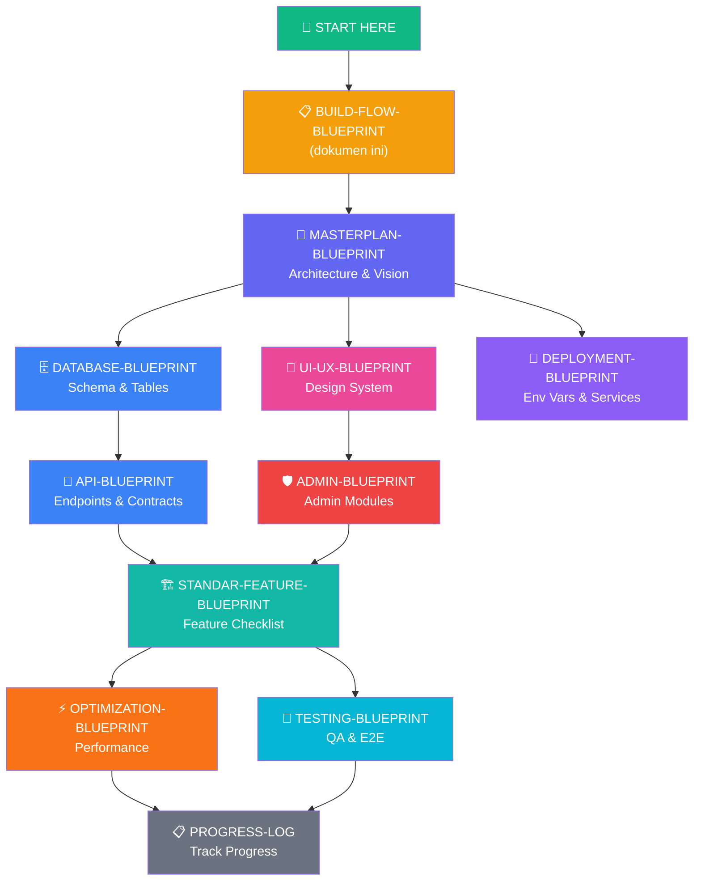
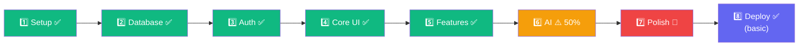
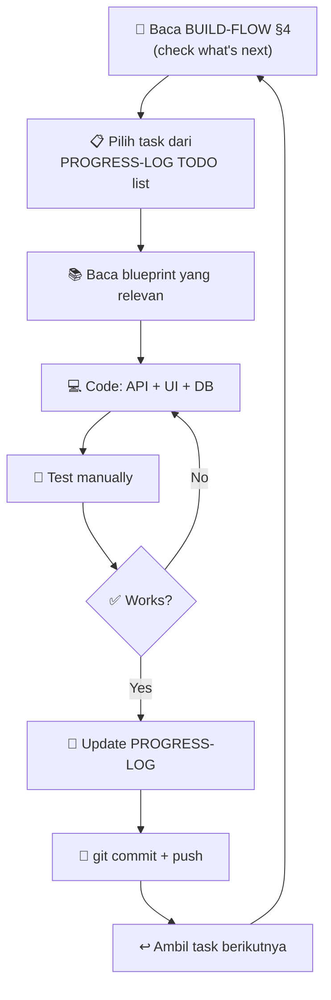

# 🗺️ CareerPath.id — BUILD FLOW BLUEPRINT
## Alur Pengembangan, Urutan Blueprint & Roadmap Implementasi

> **Status:** Active Directive  
> **Last Updated:** 2026-02-11  
> **Priority:** CRITICAL — Baca dokumen ini PERTAMA sebelum mulai develop  
> **Role:** Meta-blueprint — panduan navigasi seluruh blueprint lainnya

---

## 1. 🎯 TUJUAN DOKUMEN INI

Dokumen ini menjawab pertanyaan:
- **Blueprint mana yang harus dibaca duluan?**
- **Urutan build yang benar itu bagaimana?**
- **Setelah step ini, step berikutnya apa?**
- **Blueprint mana yang relevan di setiap tahap?**

> [!IMPORTANT]
> Ini adalah **peta navigasi** untuk **10 blueprint** dan **~400 halaman dokumentasi**. Tanpa dokumen ini, developer bisa tersesat membaca blueprint yang belum relevan.

---

## 2. 📚 BLUEPRINT MAP — Urutan Baca

### Diagram Alur Baca Blueprint



### Urutan Baca yang Benar

| # | Blueprint | Baca Kapan | Apa yang Didapat |
|:-:|-----------|------------|------------------|
| 1 | **BUILD-FLOW** (ini) | 🏁 Pertama kali | Peta navigasi, urutan kerja |
| 2 | **MASTERPLAN** | Sebelum apapun | Visi, arsitektur, AI modules, tech stack, phases |
| 3 | **DEPLOYMENT** | Sebelum coding | Env vars, setup Supabase/Groq/Midtrans |
| 4 | **DATABASE** | Sebelum backend | SQL schema, RLS, indexes — buat tables dulu |
| 5 | **UI-UX** | Sebelum frontend | Design system, colors, components, layout patterns |
| 6 | **API** | Saat buat endpoints | Request/response contracts, error standards |
| 7 | **ADMIN** | Saat buat admin panel | 18 module specs, admin CRUD, Supabase queries |
| 8 | **STANDAR-FEATURE** | Saat polish | Checklist fitur profesional yang harus ada |
| 9 | **OPTIMIZATION** | Setelah feature complete | Performance audit, lazy loading, caching |
| 10 | **TESTING** | Setelah build | E2E scenarios, QA checklist |
| 📋 | **PROGRESS-LOG** | Setiap akhir sesi | Log perubahan, track status |

---

## 3. 🏗️ BUILD ORDER — Urutan Pengembangan yang Benar

### Overview: 8 Stages

```mermaid
graph LR
    S1["1️⃣ Setup"] --> S2["2️⃣ Database"]
    S2 --> S3["3️⃣ Auth"]
    S3 --> S4["4️⃣ Core UI"]
    S4 --> S5["5️⃣ Features"]
    S5 --> S6["6️⃣ AI"]
    S6 --> S7["7️⃣ Polish"]
    S7 --> S8["8️⃣ Deploy"]
    
    style S1 fill:#6366f1,color:#fff
    style S2 fill:#3b82f6,color:#fff
    style S3 fill:#10b981,color:#fff
    style S4 fill:#ec4899,color:#fff
    style S5 fill:#f97316,color:#fff
    style S6 fill:#8b5cf6,color:#fff
    style S7 fill:#14b8a6,color:#fff
    style S8 fill:#ef4444,color:#fff
```



---

### Stage 1: 🔧 PROJECT SETUP (Day 1)

**Blueprint:** `DEPLOYMENT-BLUEPRINT.md` Section 1 & 6  
**Goal:** Project bisa berjalan di localhost

| Step | Action | Command/Detail |
|:----:|--------|----------------|
| 1.1 | Initialize Next.js project | `npx create-next-app@latest ./ --typescript --tailwind --app --src-dir` |
| 1.2 | Install core dependencies | `npm install @supabase/supabase-js @supabase/ssr groq-sdk` |
| 1.3 | Install UI dependencies | `npm install framer-motion recharts lucide-react` |
| 1.4 | Setup environment variables | Copy `.env.example` → `.env.local`, fill all required values |
| 1.5 | Create Supabase client files | `src/lib/supabase/server.ts`, `client.ts`, `middleware.ts` |
| 1.6 | Create Groq client | `src/lib/groq.ts` |
| 1.7 | Create Midtrans helper | `src/lib/midtrans.ts` |
| 1.8 | Setup middleware | `src/middleware.ts` — auth route protection |
| 1.9 | Verify `npm run dev` works | Open `http://localhost:3000` ✅ |

**Deliverables:**
- [x] Next.js app running locally
- [x] All env vars configured
- [x] Supabase, Groq, Midtrans clients created

---

### Stage 2: 🗄️ DATABASE SETUP (Day 1-2)

**Blueprint:** `DATABASE-BLUEPRINT.md` Section 2-5  
**Goal:** Semua tables, RLS, dan indexes sudah siap

| Step | Action | Blueprint Section |
|:----:|--------|-------------------|
| 2.1 | Create core tables | §3.1 `users` |
| 2.2 | Create skills domain | §3.2 `skills`, `user_skills`, `career_skills` |
| 2.3 | Create careers & jobs domain | §3.3 `careers`, `user_careers`, `jobs`, `job_applications`, `saved_jobs` |
| 2.4 | Create learning domain | §3.4 `courses`, `user_courses`, `quizzes`, `quiz_attempts`, `certificates` |
| 2.5 | Create wellness domain | §3.5 `wellness_logs`, `mood_entries`, `consultation_bookings`, `professionals` |
| 2.6 | Create community domain | §3.6 `community_posts`, `post_comments`, `post_likes` |
| 2.7 | Create evaluation domain | §3.7 `monthly_targets` |
| 2.8 | Create payment domain | §3.8 `payments` |
| 2.9 | Create notification domain | §3.9 `notifications` |
| 2.10 | Create admin domain | §3.10 `admin_audit_logs`, `page_content`, `contact_messages`, `site_settings` |
| 2.11 | Enable RLS on ALL tables | §4 — Policy templates |
| 2.12 | Create database indexes | §5 — Performance indexes |
| 2.13 | Insert seed data | §7 — Careers, skills, sample courses |

**Urutan penting:**
```
users → skills → careers → career_skills → jobs → courses
→ user_skills → user_careers → user_courses → job_applications
→ wellness_logs → mood_entries → professionals → consultation_bookings
→ community_posts → post_comments → post_likes
→ monthly_targets → payments → notifications
→ admin_audit_logs → page_content → contact_messages → site_settings
→ quizzes → quiz_attempts → certificates → saved_jobs
```

> [!CAUTION]
> **Urutan CREATE TABLE sangat penting** karena foreign key references! Table yang di-reference HARUS dibuat duluan. Ikuti urutan di atas.

**Deliverables:**
- [x] 23+ tables created di Supabase
- [x] RLS policies active
- [x] Indexes created
- [x] Seed data loaded

---

### Stage 3: 🔐 AUTHENTICATION (Day 2-3)

**Blueprint:** `MASTERPLAN-BLUEPRINT.md` §5 + `DEPLOYMENT-BLUEPRINT.md` §2.1  
**Goal:** User bisa register, login, logout

| Step | Action | Files |
|:----:|--------|-------|
| 3.1 | Setup Supabase Auth config | Supabase Dashboard → Auth → Providers |
| 3.2 | Create auth pages | `/login`, `/register` |
| 3.3 | Build auth layout | `src/app/(auth)/layout.tsx` |
| 3.4 | Implement login form | Email + password → Supabase Auth |
| 3.5 | Implement register form | Email + password → create user profile |
| 3.6 | Setup middleware protection | Protected routes: `/dashboard/*`, `/admin/*` |
| 3.7 | Build session management | Auto-redirect based on auth state |
| 3.8 | Add email verification | Supabase Auth settings (optional) |
| 3.9 | Add password reset | Via Supabase recovery email |
| 3.10 | Add session timeout | Auto-logout after 30min inactivity |

**Deliverables:**
- [x] Login & register pages working
- [x] Protected routes enforced
- [x] Session management active

---

### Stage 4: 🎨 CORE UI & LAYOUTS (Day 3-5)

**Blueprint:** `UI-UX-BLUEPRINT.md` Section 1-4  
**Goal:** Design system, layouts, dan navigation siap

```
Sequence:
Global CSS → Design Tokens → Layouts → Navigation → Shared Components
```

| Step | Action | Blueprint Section |
|:----:|--------|-------------------|
| 4.1 | Setup global CSS & design tokens | UI-UX §1.1 Colors, §1.2 Typography |
| 4.2 | Create main layout | `src/app/(main)/layout.tsx` — Navbar, Footer |
| 4.3 | Create dashboard layout | `src/app/dashboard/layout.tsx` — Sidebar + Top Bar |
| 4.4 | Create admin layout | `src/app/admin/layout.tsx` — Dark sidebar |
| 4.5 | Create auth layout | `src/app/(auth)/layout.tsx` — Split screen |
| 4.6 | Build dashboard sidebar | UI-UX §2.2 — Navigation items, active states |
| 4.7 | Build admin sidebar | UI-UX §2.3 — Dark theme navigation |
| 4.8 | Build shared components | Buttons, Cards, Modals, Forms, Badges, Tables |
| 4.9 | Build loading states | `loading.tsx` per route group — UI-UX §2.10 |
| 4.10 | Build error boundaries | `error.tsx`, `not-found.tsx` |

**Deliverables:**
- [x] 4 layouts functional (main, dashboard, admin, auth)
- [x] Navigation & sidebar working
- [x] Reusable components library ready

---

### Stage 5: 📄 FEATURES — Build Pages & APIs (Day 5-20)

**Blueprint:** `MASTERPLAN-BLUEPRINT.md` §5 + `API-BLUEPRINT.md` + `ADMIN-BLUEPRINT.md`  
**Goal:** Semua halaman dan API endpoint berfungsi

> [!IMPORTANT]
> **Regel: Build setiap fitur sebagai "vertical slice"** — artinya buat DATABASE table + API endpoint + UI page bersamaan, bukan memisahkan backend dan frontend.

#### 5A. Public Pages (Day 5-6)

| Page | Route | Blueprint |
|------|-------|-----------|
| Landing Page | `/` | UI-UX §3.1 |
| About | `/about` | UI-UX §3.5 |
| Features | `/features` | UI-UX §3.5 |
| FAQ | `/faq` | UI-UX §3.5 |
| Contact | `/contact` | API: `/api/contact` |
| Blog | `/blog` | UI-UX §3.5 |
| Privacy & Terms | `/privacy`, `/terms` | UI-UX §3.5 |
| Cookie Policy | `/cookies` | STANDAR §9.2 |

#### 5B. Onboarding (Day 6-7)

| Step | Feature | Blueprint |
|:----:|---------|-----------|
| 1 | 10-step onboarding wizard | MASTERPLAN §5 Phase 1 |
| 2 | Status, profile, university selection | DB: `users` table |
| 3 | Career interest selection | DB: `careers`, `user_careers` |
| 4 | Skill assessment | DB: `skills`, `user_skills` |
| 5 | AI career recommendation | API: `/api/ai/career-recommend` |
| 6 | Skill gap analysis | API: `/api/ai/skill-gap` |
| 7 | Monthly target setting | DB: `monthly_targets` |

#### 5C. Dashboard Features (Day 7-12) — Urutan Build

```
1. Dashboard Overview     → /dashboard           (stats aggregation)
2. Profile & Settings     → /dashboard/profile    (users table CRUD)
3. Career Explorer        → /dashboard/careers    (careers + user_careers)
4. Skill Tracking         → /dashboard/skills     (user_skills + radar chart)
5. Job Search             → /dashboard/jobs       (jobs table + filters)
6. Applications           → /dashboard/applications (job_applications)
7. Learning Module        → /dashboard/learning   (courses + user_courses)
8. Quiz System            → /dashboard/learning/quiz (quizzes + quiz_attempts)
9. Roadmap               → /dashboard/roadmap     (AI-generated)
10. Portfolio             → /dashboard/portfolio   (projects + certificates)
11. Wellness Check        → /dashboard/wellness    (wellness_logs + AI)
12. Mood Tracking         → /dashboard/mood        (mood_entries + trends)
13. Consultation          → /dashboard/consultation (bookings + video Jitsi)
14. Community             → /dashboard/community   (posts + comments + likes)
15. Leaderboard           → /dashboard/leaderboard (XP rankings)
16. Monthly Evaluation    → /dashboard/evaluation  (monthly_targets analysis)
17. Premium               → /dashboard/premium     (Midtrans Snap payment)
```

> [!TIP]
> **Build dalam urutan ini** karena setiap item bergantung pada yang sebelumnya. Contoh: Skill Tracking (#4) dibutuhkan oleh Career Explorer (#3) dan Job Search (#5) untuk menghitung match score.

#### 5D. API Endpoints (Parallel dengan UI)

Setiap halaman di atas perlu API endpoint. Buat API route **bersamaan** dengan UI page:

| Dashboard Page | API Endpoints Needed | API Blueprint Section |
|---------------|---------------------|-----------------------|
| Dashboard Overview | `/api/dashboard/stats` | §4 Business |
| Skills | `/api/user/skills` | §6 User |
| Careers | `/api/careers`, `/api/careers/[id]` | §4 Business |
| Jobs | `/api/jobs/apply` | §4 Business |
| Learning | `/api/courses` | §4 Business |
| Quiz | `/api/gamification/quizzes/*` | §8 Gamification |
| Portfolio | `/api/portfolio/certificates/*` | §4 Business |
| Wellness | `/api/wellness` | §10 Wellness |
| Community | `/api/community` | §4 Business |
| Leaderboard | `/api/gamification/leaderboard` | §8 Gamification |
| Premium | `/api/payment/*` | §5 Payment |
| Search | `/api/search` | §4 Business |
| Notifications | `/api/notifications` | §4 Business |

#### 5E. Admin Panel (Day 12-15)

**Blueprint:** `ADMIN-BLUEPRINT.md` — 18 modules

```
Build order:
1. Admin Dashboard (/admin)          → Stats overview
2. User Management (/admin/users)    → CRUD users
3. Job Management (/admin/jobs)      → CRUD jobs
4. Career Management (/admin/careers) → CRUD careers
5. Skill Management (/admin/skills)   → CRUD skills
6. Content Editor (/admin/content)    → CMS page_content
7. Messages (/admin/messages)         → Contact submissions
8. Analytics (/admin/analytics)       → Charts & reports
9. Audit Logs (/admin/logs)          → Admin action history
10. Settings (/admin/settings)        → Site settings
11. [Future] Course Management        → ADMIN §7
12. [Future] Community Management     → ADMIN §8
13. [Future] Consultant Management    → ADMIN §9
etc.
```

#### 5F. AI Modules Integration (Day 15-18)

**Blueprint:** `MASTERPLAN-BLUEPRINT.md` §3 + `API-BLUEPRINT.md` §2

```
Build order (by dependency):
1. Career Recommender (Module 1)     → Used in onboarding        ✅ Done
2. Skill Gap Analyzer (Module 2)     → Used in onboarding        ✅ Done
3. Career Chatbot (Module 6)         → Floating FAB everywhere   ✅ Done
4. Learning Recommender (Module 3)   → Used in /dashboard/learning ⚠️ Partial
5. Job Matcher (Module 4)            → Used in /dashboard/jobs    ⚠️ Partial
6. Progress Predictor (Module 5)     → Used in /dashboard/evaluation 🔲 TODO
7. Sentiment Analyzer (Module 7)     → Used in /dashboard/mood    🔲 TODO
8. AI Utility Tools                  → Cover letter, CV review, interview prep ✅ Done
```

**Deliverables:**
- [x] 48 pages functional (12 public + 21 dashboard + 11 admin + 4 special)
- [x] 56 API endpoints working
- [x] 4/8 AI modules active

---

### Stage 6: 💳 PAYMENT & PREMIUM (Day 18-19)

**Blueprint:** `API-BLUEPRINT.md` §5 + `DEPLOYMENT-BLUEPRINT.md` §2.3  
**Goal:** User bisa bayar dan upgrade ke premium

| Step | Action |
|:----:|--------|
| 6.1 | Setup Midtrans Sandbox | Get server key + client key |
| 6.2 | Build `/api/payment/create` | Create Snap transaction |
| 6.3 | Build `/api/payment/webhook` | Handle Midtrans callback |
| 6.4 | Build `/api/payment/status` | Check payment status |
| 6.5 | Build premium page UI | `/dashboard/premium` — plans, pricing, Snap.js |
| 6.6 | Implement premium gating | Check `is_premium` for restricted features |
| 6.7 | Test end-to-end payment | Sandbox credit card: `4811 1111 1111 1114` |

---

### Stage 7: ✨ POLISH & OPTIMIZE (Day 19-22)

**Blueprint:** `OPTIMIZATION-BLUEPRINT.md` + `STANDAR-FEATURE-BLUEPRINT.md` + `TESTING-BLUEPRINT.md`

#### 7A. Performance (OPTIMIZATION-BLUEPRINT)

| Priority | Action | Impact |
|:--------:|--------|--------|
| P0 | Add `images` config to `next.config.ts` | Enable WebP/AVIF auto-conversion |
| P0 | Migrate `` → `<Image>` | 30-60% smaller images |
| P0 | Lazy load Recharts & Framer Motion | -330KB initial bundle |
| P0 | Add `loading.tsx` per route | No flash of empty content |
| P1 | Convert static pages to Server Components | Less client JS, better SEO |
| P1 | Implement API caching (SWR) | Instant re-navigation |
| P1 | Add SEO metadata to all pages | Better Google ranking |
| P2 | PWA manifest & service worker | Offline capable |

#### 7B. Standard Features (STANDAR-FEATURE-BLUEPRINT)

| Priority | Feature | Section |
|:--------:|---------|---------|
| P0 | Google OAuth | §1.1 |
| P0 | Rate limiting hardening | §1.3 |
| P1 | Dark Mode | §5 Responsiveness |
| P1 | Transactional emails | §2 Communication |
| P1 | Badge & achievement system | §6 Gamification |
| P1 | Daily login streak | §6 Gamification |
| P2 | AI Resume Review UI integration | §15 Advanced |
| P2 | Salary calculator | §15 Advanced |
| P2 | Career transition map | §15 Advanced |

#### 7C. Testing (TESTING-BLUEPRINT)

| Step | Action |
|:----:|--------|
| 1 | Setup Playwright config | Local + CI |
| 2 | Write critical path E2E tests | Auth, onboarding, dashboard navigation |
| 3 | Write feature E2E tests | Skills, jobs, community, payment |
| 4 | Run full test suite | `npx playwright test` |
| 5 | Fix failures & edge cases | Iterate until green |

---

### Stage 8: 🚀 DEPLOY & MONITOR (Day 22+)

**Blueprint:** `DEPLOYMENT-BLUEPRINT.md` §3-5  
**Goal:** Website live di production

| Step | Action |
|:----:|--------|
| 8.1 | Complete deployment checklist | DEPLOYMENT §4 |
| 8.2 | Set all env vars on Vercel | Dashboard → Settings → Environment Variables |
| 8.3 | Connect custom domain | `careerpath.id` |
| 8.4 | Switch Midtrans to production | Change keys, set `MIDTRANS_IS_PRODUCTION=true` |
| 8.5 | Test production build | `npm run build` → check errors |
| 8.6 | Deploy | `git push origin main` → auto-deploy |
| 8.7 | Verify live site | Check all pages, test login, test payment |
| 8.8 | Setup monitoring | Sentry, Vercel Analytics (Phase 4) |

---

## 4. 📊 CURRENT STATUS — Dimana Kita Sekarang?



### Apa yang SUDAH Selesai (✅)

| Stage | Progress | Detail |
|-------|:--------:|--------|
| 1. Setup | 100% | Next.js + Supabase + Groq + Midtrans configured |
| 2. Database | 100% | 23+ tables, RLS, indexes |
| 3. Auth | 100% | Login, register, email verification, session timeout |
| 4. Core UI | 100% | 4 layouts, sidebar, 10 shared components |
| 5. Features | 95% | 48 pages, 56 API routes, admin panel |
| 6. AI | 50% | 4/8 modules active, 4 TODO |
| 7. Polish | 20% | Security headers done, optimization pending |
| 8. Deploy | 80% | Vercel deployed, monitoring pending |

### Apa yang HARUS Dikerjakan Selanjutnya (🔲)

```
IMMEDIATE (Minggu Ini):
├── 🤖 Complete AI Module 5: Progress Predictor
├── 🤖 Complete AI Module 7: Sentiment Analyzer
├── 🔗 Connect /dashboard/jobs to real Supabase data (bukan mock)
├── 🔗 Connect /dashboard/applications to real data
└── 📊 Add real professional data for consultation

SHORT-TERM (2 Minggu):
├── ⚡ Optimization P0: next/image, lazy loading, loading.tsx
├── 🔑 Google OAuth integration
├── 📧 Transactional emails (Resend)
├── 📊 Sentry error tracking
├── 🎮 Badge & achievement system
└── 🌙 Dark Mode

MEDIUM-TERM (1 Bulan):
├── 📱 PWA + Service Worker
├── 🔔 Real-time notifications (Supabase Realtime)
├── 📊 Vercel Analytics + PostHog
├── 🔍 Meilisearch integration
├── 📧 WhatsApp notifications
└── ⏰ Vercel Cron (streak reset, monthly eval auto)
```

---

## 5. 📋 QUICK REFERENCE — Blueprint untuk Setiap Situasi

| Situasi | Buka Blueprint |
|---------|----------------|
| "Mau mulai dari nol" | BUILD-FLOW → MASTERPLAN → DEPLOYMENT |
| "Mau buat table baru" | DATABASE |
| "Mau buat API endpoint baru" | API |
| "Mau buat halaman baru" | UI-UX (design) → API (data) |
| "Mau buat modul admin baru" | ADMIN |
| "Mau tambah fitur standar" | STANDAR-FEATURE |
| "Website lambat / perlu optimize" | OPTIMIZATION |
| "Mau test / QA" | TESTING |
| "Mau deploy ke production" | DEPLOYMENT |
| "Mau integrasikan service baru" | DEPLOYMENT §2.5 |
| "Mau catat progress" | PROGRESS-LOG |
| "Fitur AI mau ditambah" | MASTERPLAN §3 → API §2 |
| "Mau lihat status saat ini" | BUILD-FLOW §4 (ini) → PROGRESS-LOG |

---

## 6. 🔄 DEVELOPMENT WORKFLOW — Per Sprint

### Alur Kerja Harian



### Sprint Planning Template

```
Sprint Goal: [e.g., "Complete AI Modules 5 & 7"]
Duration: 1 week

Tasks:
1. [ ] Task description — Blueprint: [reference] — Est: 2h
2. [ ] Task description — Blueprint: [reference] — Est: 3h
3. [ ] Task description — Blueprint: [reference] — Est: 1h

Definition of Done:
- [ ] All tasks completed
- [ ] Manual testing passed
- [ ] PROGRESS-LOG updated
- [ ] Changes pushed to GitHub
```

---

## 7. 🗂️ FILE STRUCTURE GUIDE

### Dimana Meletakkan File Baru?

```
src/
├── app/
│   ├── (main)/           ← Public pages (landing, about, FAQ)
│   │   └── layout.tsx    ← Navbar + Footer layout
│   ├── (auth)/           ← Login, Register pages  
│   │   └── layout.tsx    ← Split-screen auth layout
│   ├── dashboard/        ← All user dashboard pages
│   │   ├── layout.tsx    ← Sidebar + TopBar layout
│   │   └── [feature]/    ← Each feature gets its own folder
│   │       └── page.tsx  ← The feature page
│   ├── admin/            ← Admin panel pages
│   │   ├── layout.tsx    ← Dark sidebar layout
│   │   └── [module]/     ← Each admin module
│   │       └── page.tsx
│   ├── api/              ← API route handlers
│   │   ├── ai/           ← All AI endpoints
│   │   ├── admin/        ← Admin-only endpoints
│   │   ├── payment/      ← Midtrans endpoints
│   │   ├── user/         ← User self-service endpoints
│   │   └── [entity]/     ← Per-entity CRUD
│   │       └── route.ts  ← GET/POST/PATCH/DELETE handlers
│   ├── onboarding/       ← 10-step wizard
│   └── b2b/              ← B2B university pages
├── components/           ← Shared/reusable components
│   ├── ui/               ← Generic UI (Button, Modal, Card)
│   └── [feature]/        ← Feature-specific components
├── lib/                  ← Utilities & service clients
│   ├── supabase/         ← Supabase client configs
│   ├── groq.ts           ← AI client + system prompts
│   └── midtrans.ts       ← Payment helper
└── types/                ← TypeScript interfaces
```

### Naming Conventions

| Type | Convention | Example |
|------|-----------|---------|
| Page file | `page.tsx` | `src/app/dashboard/skills/page.tsx` |
| Layout file | `layout.tsx` | `src/app/dashboard/layout.tsx` |
| Loading state | `loading.tsx` | `src/app/dashboard/skills/loading.tsx` |
| Error boundary | `error.tsx` | `src/app/dashboard/error.tsx` |
| API route | `route.ts` | `src/app/api/user/skills/route.ts` |
| Component | PascalCase | `SkillRadarChart.tsx` |
| Utility | camelCase | `formatCurrency.ts` |
| Types | PascalCase | `UserProfile.ts` |

---

> **📖 Referensi Blueprint:**  
> 1. `BUILD-FLOW-BLUEPRINT.md` — Dokumen ini (meta-guide)
> 2. `MASTERPLAN-BLUEPRINT.md` — Architecture & vision  
> 3. `DEPLOYMENT-BLUEPRINT.md` — Env vars & services  
> 4. `DATABASE-BLUEPRINT.md` — Schema & RLS  
> 5. `UI-UX-BLUEPRINT.md` — Design system  
> 6. `API-BLUEPRINT.md` — Endpoint contracts  
> 7. `ADMIN-BLUEPRINT.md` — Admin modules  
> 8. `STANDAR-FEATURE-BLUEPRINT.md` — Feature checklist  
> 9. `OPTIMIZATION-BLUEPRINT.md` — Performance  
> 10. `TESTING-BLUEPRINT.md` — QA & E2E  
> 📋 `PROGRESS-LOG.md` — Development changelog  
>
> **💡 Selalu mulai dari dokumen ini jika bingung mau mulai dari mana.**
