# 🗄️ CareerPath.id — DATABASE BLUEPRINT
## Panduan Lengkap Schema, RLS, Indexing & Data Management

> **Status:** Active Directive  
> **Last Updated:** 2026-02-11  
> **Priority:** CRITICAL — Supabase PostgreSQL adalah satu-satunya data store  
> **Backend:** Supabase (PostgreSQL 15+)

---

## 1. 🏗️ ARSITEKTUR DATABASE

### Database Strategy
- **Single Database:** Supabase PostgreSQL sebagai single source of truth
- **Authentication:** Supabase Auth (terpisah dari users table, linked via `auth.users.id`)
- **Storage:** Supabase Storage untuk file uploads (avatars, certificates, CV)
- **Realtime:** Supabase Realtime untuk notifications (planned)
- **ORM:** Tidak pakai ORM — langsung Supabase Client (`@supabase/supabase-js`)

### Connection Pattern

```typescript
// Browser (Client Component)
import { createBrowserClient } from '@supabase/ssr'

// Server (Server Component / API Route)
import { createClient } from '@/lib/supabase/server'

// Service Role (Webhooks — bypass RLS)
import { createClient } from '@supabase/supabase-js'
const supabase = createClient(url, process.env.SUPABASE_SERVICE_ROLE_KEY!)
```

---

## 2. 📊 ENTITY RELATIONSHIP DIAGRAM

```mermaid
erDiagram
    USERS ||--o{ USER_SKILLS : has
    USERS ||--o{ USER_CAREERS : selects
    USERS ||--o{ USER_COURSES : enrolls
    USERS ||--o{ CERTIFICATES : uploads
    USERS ||--o{ JOB_APPLICATIONS : applies
    USERS ||--o{ MOOD_ENTRIES : tracks
    USERS ||--o{ MONTHLY_TARGETS : sets
    USERS ||--o{ COMMUNITY_POSTS : creates
    USERS ||--o{ POST_COMMENTS : writes
    USERS ||--o{ NOTIFICATIONS : receives
    USERS ||--o{ WELLNESS_LOGS : completes
    USERS ||--o{ PAYMENTS : makes
    USERS ||--o{ CONSULTATION_BOOKINGS : books
    USERS ||--o{ ADMIN_AUDIT_LOGS : performs

    SKILLS ||--o{ USER_SKILLS : tracked_by
    CAREERS ||--o{ USER_CAREERS : chosen_by
    CAREERS ||--o{ CAREER_SKILLS : requires
    SKILLS ||--o{ CAREER_SKILLS : required_for
    COURSES ||--o{ USER_COURSES : enrolled_by
    JOBS ||--o{ JOB_APPLICATIONS : applied_to
    CAREERS ||--o{ JOBS : belongs_to
    PROFESSIONALS ||--o{ CONSULTATION_BOOKINGS : provides
    COMMUNITY_POSTS ||--o{ POST_COMMENTS : has
```



---

## 3. 📋 COMPLETE SCHEMA

### 3.1 Users & Auth Domain

#### `users` — Core user table

```sql
CREATE TABLE public.users (
    id UUID PRIMARY KEY REFERENCES auth.users(id) ON DELETE CASCADE,
    email TEXT,
    full_name TEXT,
    avatar_url TEXT,
    role TEXT DEFAULT 'user' CHECK (role IN ('user', 'admin', 'super_admin')),
    
    -- Profile Info
    status TEXT CHECK (status IN ('mahasiswa', 'fresh_graduate', 'pencari_kerja', 'profesional')),
    university TEXT,
    major TEXT,
    graduation_year INTEGER,
    city TEXT DEFAULT 'Makassar',
    phone TEXT,
    bio TEXT,
    linkedin_url TEXT,
    github_url TEXT,
    portfolio_url TEXT,
    
    -- Career
    career_target TEXT,
    career_target_id UUID REFERENCES careers(id),
    
    -- Gamification
    total_xp INTEGER DEFAULT 0,
    level INTEGER DEFAULT 1,
    streak_days INTEGER DEFAULT 0,
    last_active_at TIMESTAMPTZ,
    
    -- Premium
    is_premium BOOLEAN DEFAULT FALSE,
    premium_plan TEXT,
    premium_expires_at TIMESTAMPTZ,
    
    -- System
    onboarding_completed BOOLEAN DEFAULT FALSE,
    is_banned BOOLEAN DEFAULT FALSE,
    banned_reason TEXT,
    created_at TIMESTAMPTZ DEFAULT NOW(),
    updated_at TIMESTAMPTZ DEFAULT NOW()
);
```

> [!NOTE]
> `id` references `auth.users(id)` — Supabase Auth handles password hashing, session tokens, and email verification. This table stores the profile/business data.

---

### 3.2 Skills Domain

#### `skills` — Master skill catalog

```sql
CREATE TABLE public.skills (
    id UUID PRIMARY KEY DEFAULT gen_random_uuid(),
    name TEXT NOT NULL UNIQUE,
    category TEXT NOT NULL, -- 'Programming', 'Design', 'Data', 'Soft Skill', etc
    type TEXT DEFAULT 'hard' CHECK (type IN ('hard', 'soft')),
    description TEXT,
    icon TEXT, -- icon name or URL
    is_active BOOLEAN DEFAULT TRUE,
    created_at TIMESTAMPTZ DEFAULT NOW()
);
```

#### `user_skills` — User's skill proficiency tracking

```sql
CREATE TABLE public.user_skills (
    id UUID PRIMARY KEY DEFAULT gen_random_uuid(),
    user_id UUID NOT NULL REFERENCES users(id) ON DELETE CASCADE,
    skill_id UUID NOT NULL REFERENCES skills(id) ON DELETE CASCADE,
    proficiency_level INTEGER DEFAULT 1 CHECK (proficiency_level BETWEEN 1 AND 5),
    target_level INTEGER DEFAULT 5 CHECK (target_level BETWEEN 1 AND 5),
    progress_percentage DECIMAL(5,2) DEFAULT 0,
    source TEXT DEFAULT 'self_assessment', -- 'self_assessment', 'course', 'quiz', 'certificate'
    updated_at TIMESTAMPTZ DEFAULT NOW(),
    
    UNIQUE(user_id, skill_id)
);
```

#### `career_skills` — Skills required per career path

```sql
CREATE TABLE public.career_skills (
    id UUID PRIMARY KEY DEFAULT gen_random_uuid(),
    career_id UUID NOT NULL REFERENCES careers(id) ON DELETE CASCADE,
    skill_id UUID NOT NULL REFERENCES skills(id) ON DELETE CASCADE,
    required_level INTEGER DEFAULT 3 CHECK (required_level BETWEEN 1 AND 5),
    is_critical BOOLEAN DEFAULT FALSE, -- must-have skill
    priority INTEGER DEFAULT 1, -- learning priority order
    
    UNIQUE(career_id, skill_id)
);
```

---

### 3.3 Careers & Jobs Domain

#### `careers` — Career path catalog

```sql
CREATE TABLE public.careers (
    id UUID PRIMARY KEY DEFAULT gen_random_uuid(),
    title TEXT NOT NULL,
    slug TEXT UNIQUE,
    description TEXT,
    category TEXT, -- 'Technology', 'Design', 'Marketing', etc
    industry TEXT,
    
    -- Salary
    salary_min BIGINT,
    salary_max BIGINT,
    salary_currency TEXT DEFAULT 'IDR',
    
    -- Market Data
    demand_level TEXT DEFAULT 'medium' CHECK (demand_level IN ('low', 'medium', 'high', 'very_high')),
    job_outlook TEXT, -- growth trend description
    typical_education TEXT, -- 'S1 Informatika', etc
    
    -- Visual
    icon TEXT,
    color TEXT,
    image_url TEXT,
    
    is_active BOOLEAN DEFAULT TRUE,
    created_at TIMESTAMPTZ DEFAULT NOW(),
    updated_at TIMESTAMPTZ DEFAULT NOW()
);
```

#### `user_careers` — User's selected career paths

```sql
CREATE TABLE public.user_careers (
    id UUID PRIMARY KEY DEFAULT gen_random_uuid(),
    user_id UUID NOT NULL REFERENCES users(id) ON DELETE CASCADE,
    career_id UUID NOT NULL REFERENCES careers(id) ON DELETE CASCADE,
    match_percentage DECIMAL(5,2),
    is_primary BOOLEAN DEFAULT FALSE,
    ai_reasoning TEXT,
    selected_at TIMESTAMPTZ DEFAULT NOW(),
    
    UNIQUE(user_id, career_id)
);
```

#### `jobs` — Job listings

```sql
CREATE TABLE public.jobs (
    id UUID PRIMARY KEY DEFAULT gen_random_uuid(),
    title TEXT NOT NULL,
    company TEXT NOT NULL,
    company_logo TEXT,
    location TEXT DEFAULT 'Makassar',
    type TEXT DEFAULT 'full_time' CHECK (type IN ('full_time', 'part_time', 'internship', 'contract', 'remote')),
    
    -- Details
    description TEXT,
    requirements TEXT,
    responsibilities TEXT,
    
    -- Salary
    salary_min BIGINT,
    salary_max BIGINT,
    salary_display TEXT, -- 'Rp 6-9 juta/bulan'
    
    -- Categorization
    career_id UUID REFERENCES careers(id),
    experience_level TEXT DEFAULT 'entry' CHECK (experience_level IN ('entry', 'mid', 'senior')),
    required_skills TEXT[], -- array of skill names
    
    -- Status
    status TEXT DEFAULT 'active' CHECK (status IN ('active', 'closed', 'draft')),
    source TEXT, -- 'manual', 'scrape', 'api'
    source_url TEXT,
    
    -- Admin
    posted_by UUID REFERENCES users(id),
    is_featured BOOLEAN DEFAULT FALSE,
    expires_at TIMESTAMPTZ,
    created_at TIMESTAMPTZ DEFAULT NOW(),
    updated_at TIMESTAMPTZ DEFAULT NOW()
);
```

#### `job_applications` — User job applications

```sql
CREATE TABLE public.job_applications (
    id UUID PRIMARY KEY DEFAULT gen_random_uuid(),
    user_id UUID NOT NULL REFERENCES users(id) ON DELETE CASCADE,
    job_id UUID NOT NULL REFERENCES jobs(id) ON DELETE CASCADE,
    status TEXT DEFAULT 'applied' CHECK (status IN ('applied', 'reviewed', 'interview', 'offered', 'rejected', 'withdrawn')),
    cover_letter TEXT,
    resume_url TEXT,
    match_score DECIMAL(5,2),
    notes TEXT,
    applied_at TIMESTAMPTZ DEFAULT NOW(),
    updated_at TIMESTAMPTZ DEFAULT NOW(),
    
    UNIQUE(user_id, job_id)
);
```

#### `saved_jobs` — Bookmarked jobs

```sql
CREATE TABLE public.saved_jobs (
    id UUID PRIMARY KEY DEFAULT gen_random_uuid(),
    user_id UUID NOT NULL REFERENCES users(id) ON DELETE CASCADE,
    job_id UUID NOT NULL REFERENCES jobs(id) ON DELETE CASCADE,
    saved_at TIMESTAMPTZ DEFAULT NOW(),
    
    UNIQUE(user_id, job_id)
);
```

---

### 3.4 Learning Domain

#### `courses` — Course catalog

```sql
CREATE TABLE public.courses (
    id UUID PRIMARY KEY DEFAULT gen_random_uuid(),
    title TEXT NOT NULL,
    description TEXT,
    provider TEXT, -- 'YouTube', 'Coursera', 'Udemy', 'Internal'
    provider_url TEXT,
    thumbnail_url TEXT,
    
    -- Details
    duration_hours DECIMAL(5,1),
    difficulty TEXT DEFAULT 'beginner' CHECK (difficulty IN ('beginner', 'intermediate', 'advanced')),
    category TEXT,
    tags TEXT[],
    
    -- Skill mapping
    skill_id UUID REFERENCES skills(id),
    career_id UUID REFERENCES careers(id),
    
    -- Gamification
    xp_reward INTEGER DEFAULT 50,
    
    -- Admin
    is_published BOOLEAN DEFAULT TRUE,
    is_featured BOOLEAN DEFAULT FALSE,
    sort_order INTEGER DEFAULT 0,
    created_at TIMESTAMPTZ DEFAULT NOW(),
    updated_at TIMESTAMPTZ DEFAULT NOW()
);
```

#### `user_courses` — Enrollment & progress

```sql
CREATE TABLE public.user_courses (
    id UUID PRIMARY KEY DEFAULT gen_random_uuid(),
    user_id UUID NOT NULL REFERENCES users(id) ON DELETE CASCADE,
    course_id UUID NOT NULL REFERENCES courses(id) ON DELETE CASCADE,
    status TEXT DEFAULT 'enrolled' CHECK (status IN ('enrolled', 'in_progress', 'completed', 'dropped')),
    progress_percentage DECIMAL(5,2) DEFAULT 0,
    started_at TIMESTAMPTZ DEFAULT NOW(),
    completed_at TIMESTAMPTZ,
    xp_earned INTEGER DEFAULT 0,
    
    UNIQUE(user_id, course_id)
);
```

#### `quizzes` — Course quizzes

```sql
CREATE TABLE public.quizzes (
    id UUID PRIMARY KEY DEFAULT gen_random_uuid(),
    title TEXT NOT NULL,
    description TEXT,
    course_id UUID REFERENCES courses(id) ON DELETE CASCADE,
    skill_id UUID REFERENCES skills(id),
    
    -- Questions stored as JSONB array
    questions JSONB NOT NULL DEFAULT '[]',
    -- [{question, options: [a,b,c,d], correct_answer: 0, explanation}]
    
    time_limit_minutes INTEGER DEFAULT 15,
    passing_score INTEGER DEFAULT 70,
    xp_reward INTEGER DEFAULT 25,
    difficulty TEXT DEFAULT 'beginner',
    is_published BOOLEAN DEFAULT TRUE,
    created_at TIMESTAMPTZ DEFAULT NOW()
);
```

#### `quiz_attempts` — User quiz results

```sql
CREATE TABLE public.quiz_attempts (
    id UUID PRIMARY KEY DEFAULT gen_random_uuid(),
    user_id UUID NOT NULL REFERENCES users(id) ON DELETE CASCADE,
    quiz_id UUID NOT NULL REFERENCES quizzes(id) ON DELETE CASCADE,
    score INTEGER NOT NULL,
    passed BOOLEAN DEFAULT FALSE,
    answers JSONB, -- user's answers
    time_taken_seconds INTEGER,
    xp_earned INTEGER DEFAULT 0,
    completed_at TIMESTAMPTZ DEFAULT NOW()
);
```

#### `certificates` — Uploaded certificates

```sql
CREATE TABLE public.certificates (
    id UUID PRIMARY KEY DEFAULT gen_random_uuid(),
    user_id UUID NOT NULL REFERENCES users(id) ON DELETE CASCADE,
    title TEXT NOT NULL,
    issuer TEXT NOT NULL,
    issue_date DATE,
    expiry_date DATE,
    credential_id TEXT,
    credential_url TEXT,
    file_url TEXT, -- Supabase Storage URL
    skills_extracted TEXT[], -- AI-extracted skill tags
    verified BOOLEAN DEFAULT FALSE,
    created_at TIMESTAMPTZ DEFAULT NOW()
);
```

---

### 3.5 Wellness & Mental Health Domain

#### `wellness_logs` — GAD-7 assessments

```sql
CREATE TABLE public.wellness_logs (
    id UUID PRIMARY KEY DEFAULT gen_random_uuid(),
    user_id UUID NOT NULL REFERENCES users(id) ON DELETE CASCADE,
    responses JSONB NOT NULL, -- GAD-7 question responses
    total_score INTEGER NOT NULL,
    severity TEXT, -- 'minimal', 'mild', 'moderate', 'severe'
    risk_level TEXT DEFAULT 'low' CHECK (risk_level IN ('low', 'moderate', 'high')),
    ai_recommendation TEXT,
    created_at TIMESTAMPTZ DEFAULT NOW()
);
```

#### `mood_entries` — Daily mood tracking

```sql
CREATE TABLE public.mood_entries (
    id UUID PRIMARY KEY DEFAULT gen_random_uuid(),
    user_id UUID NOT NULL REFERENCES users(id) ON DELETE CASCADE,
    mood INTEGER NOT NULL CHECK (mood BETWEEN 1 AND 5), -- 1=very_bad, 5=very_good
    energy INTEGER CHECK (energy BETWEEN 1 AND 5),
    stress INTEGER CHECK (stress BETWEEN 1 AND 5),
    journal_text TEXT,
    tags TEXT[], -- ['kerja', 'belajar', 'relasi', etc]
    ai_sentiment TEXT, -- AI-analyzed sentiment
    created_at TIMESTAMPTZ DEFAULT NOW()
);
```

#### `consultation_bookings` — Consult session bookings

```sql
CREATE TABLE public.consultation_bookings (
    id UUID PRIMARY KEY DEFAULT gen_random_uuid(),
    user_id UUID NOT NULL REFERENCES users(id) ON DELETE CASCADE,
    professional_id UUID NOT NULL REFERENCES professionals(id),
    booking_date DATE NOT NULL,
    booking_time TIME NOT NULL,
    duration_minutes INTEGER DEFAULT 60,
    type TEXT DEFAULT 'career' CHECK (type IN ('career', 'psychology', 'both')),
    status TEXT DEFAULT 'pending' CHECK (status IN ('pending', 'confirmed', 'completed', 'cancelled', 'no_show')),
    payment_status TEXT DEFAULT 'pending' CHECK (payment_status IN ('pending', 'paid', 'refunded')),
    meeting_url TEXT, -- Jitsi Meet URL
    notes TEXT, -- post-session notes from professional
    action_items TEXT, -- homework for user
    rating INTEGER CHECK (rating BETWEEN 1 AND 5),
    created_at TIMESTAMPTZ DEFAULT NOW()
);
```

#### `professionals` — Consultant profiles

```sql
CREATE TABLE public.professionals (
    id UUID PRIMARY KEY DEFAULT gen_random_uuid(),
    name TEXT NOT NULL,
    title TEXT, -- 'Psikolog', 'Career Counselor'
    specialty TEXT,
    bio TEXT,
    avatar_url TEXT,
    rating DECIMAL(2,1) DEFAULT 5.0,
    total_reviews INTEGER DEFAULT 0,
    total_sessions INTEGER DEFAULT 0,
    price_per_session BIGINT DEFAULT 99000,
    availability JSONB, -- [{day: 'monday', slots: ['09:00', '10:00', ...]}]
    is_active BOOLEAN DEFAULT TRUE,
    created_at TIMESTAMPTZ DEFAULT NOW()
);
```

---

### 3.6 Community & Gamification Domain

#### `community_posts` — Forum posts

```sql
CREATE TABLE public.community_posts (
    id UUID PRIMARY KEY DEFAULT gen_random_uuid(),
    user_id UUID NOT NULL REFERENCES users(id) ON DELETE CASCADE,
    title TEXT,
    content TEXT NOT NULL,
    category TEXT DEFAULT 'general', -- 'general', 'career', 'success_story', 'question', 'tips'
    tags TEXT[],
    likes_count INTEGER DEFAULT 0,
    comments_count INTEGER DEFAULT 0,
    is_pinned BOOLEAN DEFAULT FALSE,
    is_hidden BOOLEAN DEFAULT FALSE,
    created_at TIMESTAMPTZ DEFAULT NOW(),
    updated_at TIMESTAMPTZ DEFAULT NOW()
);
```

#### `post_comments` — Post comments

```sql
CREATE TABLE public.post_comments (
    id UUID PRIMARY KEY DEFAULT gen_random_uuid(),
    post_id UUID NOT NULL REFERENCES community_posts(id) ON DELETE CASCADE,
    user_id UUID NOT NULL REFERENCES users(id) ON DELETE CASCADE,
    content TEXT NOT NULL,
    likes_count INTEGER DEFAULT 0,
    created_at TIMESTAMPTZ DEFAULT NOW()
);
```

#### `post_likes` — Like tracking

```sql
CREATE TABLE public.post_likes (
    id UUID PRIMARY KEY DEFAULT gen_random_uuid(),
    post_id UUID REFERENCES community_posts(id) ON DELETE CASCADE,
    comment_id UUID REFERENCES post_comments(id) ON DELETE CASCADE,
    user_id UUID NOT NULL REFERENCES users(id) ON DELETE CASCADE,
    created_at TIMESTAMPTZ DEFAULT NOW(),
    
    UNIQUE(post_id, user_id),
    CHECK (post_id IS NOT NULL OR comment_id IS NOT NULL)
);
```

---

### 3.7 Evaluation & Targets Domain

#### `monthly_targets` — Monthly goal setting

```sql
CREATE TABLE public.monthly_targets (
    id UUID PRIMARY KEY DEFAULT gen_random_uuid(),
    user_id UUID NOT NULL REFERENCES users(id) ON DELETE CASCADE,
    month INTEGER NOT NULL CHECK (month BETWEEN 1 AND 12),
    year INTEGER NOT NULL,
    
    -- Targets
    learning_target INTEGER DEFAULT 2, -- courses to complete
    application_target INTEGER DEFAULT 5, -- jobs to apply
    portfolio_target INTEGER DEFAULT 1, -- projects to add
    wellness_target INTEGER DEFAULT 15, -- mood check-ins
    
    -- Progress
    learning_progress INTEGER DEFAULT 0,
    application_progress INTEGER DEFAULT 0,
    portfolio_progress INTEGER DEFAULT 0,
    wellness_progress INTEGER DEFAULT 0,
    
    -- Evaluation
    overall_score DECIMAL(5,2),
    ai_evaluation TEXT,
    ai_next_month_suggestion TEXT,
    evaluated_at TIMESTAMPTZ,
    
    created_at TIMESTAMPTZ DEFAULT NOW(),
    UNIQUE(user_id, month, year)
);
```

---

### 3.8 Payment & Premium Domain

#### `payments` — Transaction records

```sql
CREATE TABLE public.payments (
    id UUID PRIMARY KEY DEFAULT gen_random_uuid(),
    user_id UUID NOT NULL REFERENCES users(id) ON DELETE CASCADE,
    order_id TEXT UNIQUE NOT NULL, -- 'CP-{userId}-{timestamp}'
    
    -- Payment Details
    amount BIGINT NOT NULL,
    currency TEXT DEFAULT 'IDR',
    plan_type TEXT NOT NULL, -- 'premium_monthly', 'premium_yearly', 'consultation'
    consultation_id UUID REFERENCES consultation_bookings(id),
    
    -- Midtrans
    payment_type TEXT, -- 'gopay', 'bank_transfer', 'credit_card', etc
    snap_token TEXT,
    midtrans_response JSONB,
    
    -- Status
    status TEXT DEFAULT 'pending' CHECK (status IN ('pending', 'paid', 'failed', 'expired', 'refunded', 'challenge')),
    
    created_at TIMESTAMPTZ DEFAULT NOW(),
    updated_at TIMESTAMPTZ DEFAULT NOW()
);
```

---

### 3.9 Notification Domain

#### `notifications` — In-app notifications

```sql
CREATE TABLE public.notifications (
    id UUID PRIMARY KEY DEFAULT gen_random_uuid(),
    user_id UUID NOT NULL REFERENCES users(id) ON DELETE CASCADE,
    type TEXT DEFAULT 'info' CHECK (type IN ('info', 'success', 'warning', 'error', 'achievement')),
    title TEXT NOT NULL,
    message TEXT NOT NULL,
    link TEXT, -- optional deep link
    is_read BOOLEAN DEFAULT FALSE,
    read_at TIMESTAMPTZ,
    created_at TIMESTAMPTZ DEFAULT NOW()
);
```

---

### 3.10 Admin Domain

#### `admin_audit_logs` — Admin action tracking

```sql
CREATE TABLE public.admin_audit_logs (
    id UUID PRIMARY KEY DEFAULT gen_random_uuid(),
    admin_id UUID NOT NULL REFERENCES users(id),
    action TEXT NOT NULL, -- 'CREATE_JOB', 'UPDATE_USER', 'DELETE_POST', etc
    target_type TEXT, -- 'user', 'job', 'career', 'skill', etc
    target_id TEXT,
    details JSONB, -- additional context
    ip_address TEXT,
    user_agent TEXT,
    created_at TIMESTAMPTZ DEFAULT NOW()
);
```

#### `page_content` — CMS editable content

```sql
CREATE TABLE public.page_content (
    id UUID PRIMARY KEY DEFAULT gen_random_uuid(),
    page_name TEXT UNIQUE NOT NULL, -- 'about', 'features', 'faq', 'blog'
    content JSONB NOT NULL DEFAULT '{}',
    updated_by UUID REFERENCES users(id),
    updated_at TIMESTAMPTZ DEFAULT NOW()
);
```

#### `contact_messages` — Contact form submissions

```sql
CREATE TABLE public.contact_messages (
    id UUID PRIMARY KEY DEFAULT gen_random_uuid(),
    name TEXT NOT NULL,
    email TEXT NOT NULL,
    subject TEXT,
    message TEXT NOT NULL,
    status TEXT DEFAULT 'new' CHECK (status IN ('new', 'read', 'replied', 'archived')),
    admin_notes TEXT,
    replied_by UUID REFERENCES users(id),
    created_at TIMESTAMPTZ DEFAULT NOW()
);
```

#### `site_settings` — Global settings

```sql
CREATE TABLE public.site_settings (
    id UUID PRIMARY KEY DEFAULT gen_random_uuid(),
    key TEXT UNIQUE NOT NULL,
    value JSONB NOT NULL,
    description TEXT,
    updated_by UUID REFERENCES users(id),
    updated_at TIMESTAMPTZ DEFAULT NOW()
);
```

---

## 4. 🔐 ROW LEVEL SECURITY (RLS)

### RLS Principles
1. **Users** hanya bisa akses data milik sendiri
2. **Admin** bisa akses semua data
3. **Public** bisa lihat data tertentu (career catalog, courses, jobs)
4. **Service Role** bypass RLS (untuk webhooks, cron)

### Policy Templates

#### User-owned data (user_skills, mood_entries, etc)

```sql
-- Enable RLS
ALTER TABLE user_skills ENABLE ROW LEVEL SECURITY;

-- Users can CRUD their own data
CREATE POLICY "Users manage own skills"
ON user_skills FOR ALL
USING (auth.uid() = user_id)
WITH CHECK (auth.uid() = user_id);

-- Admins can read all
CREATE POLICY "Admins read all skills"
ON user_skills FOR SELECT
USING (
    EXISTS (
        SELECT 1 FROM users
        WHERE id = auth.uid() AND role IN ('admin', 'super_admin')
    )
);
```

#### Public catalog data (careers, courses, jobs, skills)

```sql
ALTER TABLE careers ENABLE ROW LEVEL SECURITY;

-- Anyone can read active items
CREATE POLICY "Public read active careers"
ON careers FOR SELECT
USING (is_active = TRUE);

-- Only admins can CUD
CREATE POLICY "Admins manage careers"
ON careers FOR ALL
USING (
    EXISTS (
        SELECT 1 FROM users
        WHERE id = auth.uid() AND role IN ('admin', 'super_admin')
    )
);
```

#### Admin-only data (audit_logs, site_settings)

```sql
ALTER TABLE admin_audit_logs ENABLE ROW LEVEL SECURITY;

CREATE POLICY "Admins only"
ON admin_audit_logs FOR ALL
USING (
    EXISTS (
        SELECT 1 FROM users
        WHERE id = auth.uid() AND role IN ('admin', 'super_admin')
    )
);
```

### RLS Status per Table

| Table | RLS Enabled | Policies |
|-------|:-----------:|----------|
| users | ✅ | Own data + admin read all |
| user_skills | ✅ | Own data |
| user_careers | ✅ | Own data |
| user_courses | ✅ | Own data |
| skills | ✅ | Public read + admin CUD |
| careers | ✅ | Public read + admin CUD |
| courses | ✅ | Public read + admin CUD |
| jobs | ✅ | Public read active + admin CUD |
| job_applications | ✅ | Own data |
| certificates | ✅ | Own data |
| mood_entries | ✅ | Own data |
| wellness_logs | ✅ | Own data |
| community_posts | ✅ | Public read + own CUD |
| post_comments | ✅ | Public read + own CUD |
| notifications | ✅ | Own data only |
| payments | ✅ | Own data + admin read |
| monthly_targets | ✅ | Own data |
| admin_audit_logs | ✅ | Admin only |
| page_content | ✅ | Public read + admin CUD |
| contact_messages | ✅ | Insert public + admin read |
| professionals | ✅ | Public read + admin CUD |
| consultation_bookings | ✅ | Own data + admin read |
| site_settings | ✅ | Admin only |

---

## 5. 📇 DATABASE INDEXES

### Critical Performance Indexes

```sql
-- User lookups
CREATE INDEX idx_users_role ON users(role);
CREATE INDEX idx_users_email ON users(email);
CREATE INDEX idx_users_university ON users(university);
CREATE INDEX idx_users_total_xp ON users(total_xp DESC);
CREATE INDEX idx_users_created_at ON users(created_at DESC);

-- Skill tracking
CREATE INDEX idx_user_skills_user ON user_skills(user_id);
CREATE INDEX idx_user_skills_skill ON user_skills(skill_id);
CREATE INDEX idx_career_skills_career ON career_skills(career_id);

-- Job search
CREATE INDEX idx_jobs_status ON jobs(status);
CREATE INDEX idx_jobs_career ON jobs(career_id);
CREATE INDEX idx_jobs_location ON jobs(location);
CREATE INDEX idx_jobs_type ON jobs(type);
CREATE INDEX idx_jobs_created_at ON jobs(created_at DESC);
CREATE INDEX idx_job_applications_user ON job_applications(user_id);
CREATE INDEX idx_job_applications_status ON job_applications(status);

-- Learning
CREATE INDEX idx_courses_skill ON courses(skill_id);
CREATE INDEX idx_courses_career ON courses(career_id);
CREATE INDEX idx_courses_difficulty ON courses(difficulty);
CREATE INDEX idx_user_courses_user ON user_courses(user_id);
CREATE INDEX idx_user_courses_status ON user_courses(status);

-- Community
CREATE INDEX idx_posts_category ON community_posts(category);
CREATE INDEX idx_posts_user ON community_posts(user_id);
CREATE INDEX idx_posts_created_at ON community_posts(created_at DESC);
CREATE INDEX idx_comments_post ON post_comments(post_id);

-- Notifications
CREATE INDEX idx_notifications_user ON notifications(user_id);
CREATE INDEX idx_notifications_read ON notifications(user_id, is_read);
CREATE INDEX idx_notifications_created ON notifications(created_at DESC);

-- Payments
CREATE INDEX idx_payments_user ON payments(user_id);
CREATE INDEX idx_payments_order ON payments(order_id);
CREATE INDEX idx_payments_status ON payments(status);

-- Wellness
CREATE INDEX idx_mood_user ON mood_entries(user_id);
CREATE INDEX idx_mood_created ON mood_entries(created_at DESC);
CREATE INDEX idx_wellness_user ON wellness_logs(user_id);

-- Admin
CREATE INDEX idx_audit_admin ON admin_audit_logs(admin_id);
CREATE INDEX idx_audit_action ON admin_audit_logs(action);
CREATE INDEX idx_audit_created ON admin_audit_logs(created_at DESC);

-- Full text search
CREATE INDEX idx_jobs_title_search ON jobs USING gin(to_tsvector('indonesian', title || ' ' || company));
CREATE INDEX idx_courses_title_search ON courses USING gin(to_tsvector('indonesian', title));
CREATE INDEX idx_posts_content_search ON community_posts USING gin(to_tsvector('indonesian', content));
```

---

## 6. 🌱 SEED DATA STRATEGY

### Required Seed Data (Must exist before production)

| Table | Count | Source |
|-------|-------|--------|
| skills | 50+ | Curated: tech + soft skills |
| careers | 10-15 | Curated: popular Indonesian careers |
| career_skills | 60+ | Mapped: 4-6 skills per career |
| courses | 30+ | Curated: free courses from YouTube, Coursera |
| quizzes | 10+ | AI-generated per skill |
| professionals | 5-10 | Mock or real consultants |
| jobs | 20+ | Mock or scraped from job portals |
| page_content | 4 | about, features, faq, blog content |
| site_settings | 5+ | Default site configuration |

### Seed Script Example

```sql
-- Skills Seed
INSERT INTO skills (name, category, type) VALUES
('Python', 'Programming', 'hard'),
('JavaScript', 'Programming', 'hard'),
('SQL', 'Data', 'hard'),
('React', 'Web Development', 'hard'),
('Figma', 'Design', 'hard'),
('Git', 'Tools', 'hard'),
('Communication', 'Interpersonal', 'soft'),
('Problem Solving', 'Thinking', 'soft'),
('Leadership', 'Management', 'soft'),
('Time Management', 'Productivity', 'soft');

-- Careers Seed
INSERT INTO careers (title, category, salary_min, salary_max, demand_level) VALUES
('Data Analyst', 'Technology', 6000000, 12000000, 'very_high'),
('Software Engineer', 'Technology', 8000000, 20000000, 'very_high'),
('UI/UX Designer', 'Design', 5000000, 15000000, 'high'),
('Digital Marketing', 'Marketing', 4000000, 10000000, 'high'),
('Product Manager', 'Technology', 10000000, 25000000, 'high');
```

---

## 7. 🔄 MIGRATION STRATEGY

### Workflow

```
1. Buat file SQL baru: supabase/migrations/YYYYMMDD_description.sql
2. Test locally: npx supabase db push (development)
3. Review changes
4. Apply to production via Supabase Dashboard
```

### Migration Naming Convention

```
20260201_create_users_table.sql
20260201_create_skills_table.sql
20260202_create_careers_and_jobs.sql
20260203_create_learning_tables.sql
20260204_create_wellness_tables.sql
20260205_create_community_tables.sql
20260206_create_payment_tables.sql
20260207_add_indexes.sql
20260208_create_rls_policies.sql
20260209_seed_initial_data.sql
```

---

## 8. 💾 SUPABASE STORAGE BUCKETS

| Bucket | Purpose | Public | Max Size |
|--------|---------|--------|----------|
| `avatars` | User profile photos | ✅ Yes | 2MB |
| `certificates` | Certificate uploads | ❌ Private | 5MB |
| `resumes` | CV/Resume files | ❌ Private | 10MB |
| `portfolio` | Portfolio project images | ✅ Yes | 5MB |
| `content` | CMS media library | ✅ Yes | 10MB |

### Storage RLS

```sql
-- avatars: users can upload own, anyone can read
CREATE POLICY "Avatar upload" ON storage.objects FOR INSERT
WITH CHECK (bucket_id = 'avatars' AND auth.uid()::text = (storage.foldername(name))[1]);

CREATE POLICY "Avatar public read" ON storage.objects FOR SELECT
USING (bucket_id = 'avatars');

-- certificates: only own user
CREATE POLICY "Certificate private" ON storage.objects FOR ALL
USING (bucket_id = 'certificates' AND auth.uid()::text = (storage.foldername(name))[1]);
```

---

## 9. 📊 QUERY OPTIMIZATION BEST PRACTICES

### DO ✅

```typescript
// Select only needed columns
const { data } = await supabase
  .from('users')
  .select('id, full_name, avatar_url, total_xp')

// Use pagination
const { data } = await supabase
  .from('jobs')
  .select('*', { count: 'exact' })
  .range(offset, offset + limit - 1)

// Use joins instead of multiple queries
const { data } = await supabase
  .from('user_skills')
  .select('*, skills(name, category)')
  .eq('user_id', userId)
```

### DON'T ❌

```typescript
// Don't select * when you only need a few fields
const { data } = await supabase.from('users').select('*')

// Don't fetch all records without limit
const { data } = await supabase.from('jobs').select('*')

// Don't make N+1 queries
for (const user of users) {
  const skills = await supabase.from('user_skills').select('*').eq('user_id', user.id)
}
```

---

> **Dokumen ini harus di-update setiap kali ada perubahan schema, policy, atau index baru.**
