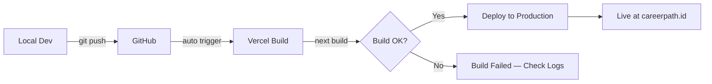

# 🚀 CareerPath.id — DEPLOYMENT BLUEPRINT
## Environment Variables, External Services & Deployment Configuration

> **Status:** Active Directive  
> **Last Updated:** 2026-02-11  
> **Priority:** CRITICAL — Tanpa konfigurasi ini, aplikasi TIDAK akan berjalan  
> **Platform:** Vercel (hosting) + Supabase (backend) + Groq (AI) + Midtrans (payment)

---

## 1. 🔐 ENVIRONMENT VARIABLES

### Complete `.env.local` Template

```bash
# ============================================
# CareerPath.id — Environment Variables
# Copy this file as .env.local and fill all values
# ============================================

# ─── SUPABASE (REQUIRED) ─────────────────────
# Source: https://supabase.com/dashboard/project/YOUR_PROJECT/settings/api
NEXT_PUBLIC_SUPABASE_URL=https://xxxxx.supabase.co
NEXT_PUBLIC_SUPABASE_ANON_KEY=eyJhbGciOiJIUzI1NiIs...
SUPABASE_SERVICE_ROLE_KEY=eyJhbGciOiJIUzI1NiIs...

# ─── GROQ AI (REQUIRED) ──────────────────────
# Source: https://console.groq.com/keys
GROQ_API_KEY=gsk_xxxxxxxxxxxxxxxxxxxx

# ─── MIDTRANS PAYMENT (REQUIRED) ─────────────
# Source: https://dashboard.midtrans.com/settings/config_info
MIDTRANS_SERVER_KEY=SB-Mid-server-xxxxx
MIDTRANS_CLIENT_KEY=SB-Mid-client-xxxxx
NEXT_PUBLIC_MIDTRANS_CLIENT_KEY=SB-Mid-client-xxxxx
MIDTRANS_IS_PRODUCTION=false

# ─── LINKEDIN OAUTH (OPTIONAL) ───────────────
# Source: https://www.linkedin.com/developers/apps
LINKEDIN_CLIENT_ID=xxxxxxxxxx
LINKEDIN_CLIENT_SECRET=xxxxxxxxxx

# ─── APPLICATION (REQUIRED) ──────────────────
NEXT_PUBLIC_APP_URL=https://careerpath.id
NODE_ENV=production

# ─── FUTURE / PLANNED ────────────────────────
# GOOGLE_CLIENT_ID=                    # Google OAuth (Phase 4)
# GOOGLE_CLIENT_SECRET=                # Google OAuth (Phase 4)
# SENTRY_DSN=                          # Error tracking (Phase 4)
# RESEND_API_KEY=                      # Transactional emails (Phase 4)
# NEXT_PUBLIC_GA_ID=                   # Google Analytics (Phase 4)
# VERCEL_ANALYTICS_ID=                 # Vercel Analytics (Phase 4)
```

### Variable Reference Table

| Variable | Required | Public | Service | Used By |
|----------|:--------:|:------:|---------|---------|
| `NEXT_PUBLIC_SUPABASE_URL` | ✅ | Yes | Supabase | Auth, DB, Storage |
| `NEXT_PUBLIC_SUPABASE_ANON_KEY` | ✅ | Yes | Supabase | Client-side queries |
| `SUPABASE_SERVICE_ROLE_KEY` | ✅ | No | Supabase | Webhooks, B2B reports, bypass RLS |
| `GROQ_API_KEY` | ✅ | No | Groq | All 11 AI endpoints |
| `MIDTRANS_SERVER_KEY` | ✅ | No | Midtrans | Payment create, webhook verify |
| `MIDTRANS_CLIENT_KEY` | ✅ | No | Midtrans | Server-side payment |
| `NEXT_PUBLIC_MIDTRANS_CLIENT_KEY` | ✅ | Yes | Midtrans | Snap.js on premium page |
| `MIDTRANS_IS_PRODUCTION` | ✅ | No | Midtrans | Toggle sandbox/production |
| `LINKEDIN_CLIENT_ID` | ❌ | No | LinkedIn | OAuth flow |
| `LINKEDIN_CLIENT_SECRET` | ❌ | No | LinkedIn | OAuth callback |
| `NEXT_PUBLIC_APP_URL` | ✅ | Yes | Internal | Redirect URLs, OG tags |
| `NODE_ENV` | Auto | No | Node.js | Auto-set by Vercel |

> [!CAUTION]
> **NEVER commit `.env.local` to Git!** Pastikan `.gitignore` sudah include `.env*`. Variabel `SUPABASE_SERVICE_ROLE_KEY` bisa bypass RLS — JANGAN di-expose ke client.

---

## 2. 🌐 EXTERNAL SERVICES

### 2.1 Supabase — Database, Auth & Storage

| Item | Detail |
|------|--------|
| **Website** | [supabase.com](https://supabase.com) |
| **Plan** | Free tier (500MB DB, 1GB storage, 50K MAU) |
| **Region** | Southeast Asia (Singapore) — recommended |
| **Used For** | PostgreSQL database, Auth (email/password), Storage (avatars, certificates) |

**Setup Steps:**
1. Create project di [supabase.com/dashboard](https://supabase.com/dashboard)
2. Copy `Project URL` → `NEXT_PUBLIC_SUPABASE_URL`
3. Copy `anon (public)` key → `NEXT_PUBLIC_SUPABASE_ANON_KEY`
4. Copy `service_role (secret)` key → `SUPABASE_SERVICE_ROLE_KEY`
5. Run SQL schema dari `DATABASE-BLUEPRINT.md` Section 3
6. Enable RLS policies dari `DATABASE-BLUEPRINT.md` Section 4
7. Configure Auth settings:
   - Enable Email provider
   - Set Site URL: `https://careerpath.id`
   - Set Redirect URLs: `https://careerpath.id/**`
   - Optional: Disable email confirmation for dev

**Files yang menggunakan:**
- `src/lib/supabase/server.ts` — Server client
- `src/lib/supabase/client.ts` — Browser client
- `src/lib/supabase/middleware.ts` — Auth middleware
- `src/app/api/payment/webhook/route.ts` — Service role (bypass RLS)
- `src/app/api/b2b/analytics/route.ts` — Service role
- `src/app/api/b2b/reports/route.ts` — Service role

---

### 2.2 Groq — AI Language Model

| Item | Detail |
|------|--------|
| **Website** | [console.groq.com](https://console.groq.com) |
| **Plan** | Free tier (30 req/min, 14.4K tokens/min) |
| **Model** | `llama-3.3-70b-versatile` |
| **Used For** | Career recommendations, chatbot, skill gap analysis, wellness analysis, etc |

**Setup Steps:**
1. Sign up di [console.groq.com](https://console.groq.com)
2. Go to API Keys → Create API Key
3. Copy key → `GROQ_API_KEY`

**Files yang menggunakan:**
- `src/lib/groq.ts` — Groq client singleton + system prompts
- `src/app/api/ai/career-recommend/route.ts`
- `src/app/api/ai/chat/route.ts`
- `src/app/api/ai/skill-gap/route.ts`
- `src/app/api/ai/learning-recommend/route.ts`
- `src/app/api/ai/progress-predict/route.ts`
- `src/app/api/ai/sentiment/route.ts`
- `src/app/api/ai/cover-letter/route.ts`
- `src/app/api/ai/cv-review/route.ts`
- `src/app/api/ai/interview-prep/route.ts`
- `src/app/api/ai/portfolio-review/route.ts`
- `src/app/api/wellness/route.ts`
- `src/app/api/gamification/challenges/route.ts`

**Rate Limit Considerations:**

| Plan | Requests/min | Tokens/min | Requests/day |
|------|:------------:|:----------:|:------------:|
| Free | 30 | 14,400 | 14,400 |
| Developer | 30 | 30,000 | 14,400 |
| Production | Custom | Custom | Custom |

> [!IMPORTANT]
> Groq free tier sudah cukup untuk development dan early users (~100 MAU). Jika scale ke 1000+ MAU, perlu upgrade ke paid plan atau implement response caching.

---

### 2.3 Midtrans — Payment Gateway

| Item | Detail |
|------|--------|
| **Website** | [midtrans.com](https://midtrans.com) |
| **Plan** | Pay per transaction (2.6% + Rp 1.500 per transaksi) |
| **Mode** | Sandbox (testing) → Production (live) |
| **Used For** | Premium subscription, consultation payment |

**Setup Steps:**
1. Register di [dashboard.midtrans.com](https://dashboard.midtrans.com)
2. Pilih **Sandbox** mode untuk testing
3. Settings → Access Keys → Copy keys:
   - `Server Key` → `MIDTRANS_SERVER_KEY`
   - `Client Key` → `MIDTRANS_CLIENT_KEY` dan `NEXT_PUBLIC_MIDTRANS_CLIENT_KEY`
4. Settings → Snap Preferences → Set **Finish URL**: `https://careerpath.id/dashboard/settings?payment=success`
5. Settings → Payment Notification URL: `https://careerpath.id/api/payment/webhook`
6. Untuk production: Submit dokumen bisnis, lalu ganti keys dan set `MIDTRANS_IS_PRODUCTION=true`

**Payment Methods Available:**
| Method | Sandbox | Production |
|--------|:-------:|:----------:|
| GoPay | ✅ | ✅ |
| Bank Transfer (BCA, BNI, BRI, Mandiri) | ✅ | ✅ |
| Credit Card (Visa, Mastercard) | ✅ | ✅ |
| ShopeePay | ❌ | ✅ |
| QRIS | ✅ | ✅ |

**Files yang menggunakan:**
- `src/lib/midtrans.ts` — Midtrans Snap helper
- `src/app/api/payment/create/route.ts` — Create transaction
- `src/app/api/payment/webhook/route.ts` — Verify & process payment
- `src/app/api/payment/status/route.ts` — Check payment status
- `src/app/dashboard/premium/page.tsx` — Snap.js client script

> [!WARNING]
> **Webhook URL HARUS publicly accessible!** Midtrans akan POST ke `/api/payment/webhook` setelah payment selesai. Di localhost, gunakan tool seperti [ngrok](https://ngrok.com) untuk tunnel.

---

### 2.4 LinkedIn — OAuth Integration

| Item | Detail |
|------|--------|
| **Website** | [linkedin.com/developers](https://www.linkedin.com/developers/apps) |
| **Plan** | Free |
| **Status** | ⚠️ Optional — endpoints exist, not critical |
| **Used For** | Import profile data from LinkedIn |

**Setup Steps:**
1. Go to [LinkedIn Developer Portal](https://www.linkedin.com/developers/apps)
2. Create a new app → Fill company details
3. Under Products → Request access to "Sign In with LinkedIn using OpenID Connect"
4. Auth tab → Set Authorized redirect URLs: `https://careerpath.id/api/integrations/linkedin/callback`
5. Copy Client ID → `LINKEDIN_CLIENT_ID`
6. Copy Client Secret → `LINKEDIN_CLIENT_SECRET`

**Files yang menggunakan:**
- `src/app/api/integrations/linkedin/route.ts` — Start OAuth flow
- `src/app/api/integrations/linkedin/callback/route.ts` — Handle callback

---

### 2.5 🔮 FUTURE EXTERNAL SERVICES — Roadmap Lengkap

Berikut adalah **semua external services** yang bisa diintegrasikan untuk pengembangan CareerPath.id lebih lanjut, dikelompokkan per kategori:

---

#### 🔑 A. Authentication & Social Login

| Service | Purpose | Env Var(s) | Priority | Free Tier |
|---------|---------|------------|:--------:|-----------|
| **Google OAuth** | "Login with Google" — paling penting untuk Gen Z | `GOOGLE_CLIENT_ID`, `GOOGLE_CLIENT_SECRET` | **P0** | ✅ Unlimited |
| **GitHub OAuth** | Login untuk tech/developer users | `GITHUB_CLIENT_ID`, `GITHUB_CLIENT_SECRET` | P2 | ✅ Unlimited |
| **Apple Sign In** | Login untuk iOS users (wajib jika buat mobile app) | `APPLE_CLIENT_ID`, `APPLE_CLIENT_SECRET`, `APPLE_TEAM_ID` | P3 | ✅ Unlimited |

> [!TIP]
> **Google OAuth = PRIORITAS #1** setelah PKM. 80%+ Gen Z Indonesia pakai akun Google. Setup via Supabase Auth Providers sangat mudah (hanya perlu Client ID + Secret).

---

#### 📧 B. Email & Komunikasi

| Service | Purpose | Env Var(s) | Priority | Free Tier |
|---------|---------|------------|:--------:|-----------|
| **Resend** | Transactional emails (welcome, reports, reminders) | `RESEND_API_KEY` | **P1** | 100 emails/day |
| **SendGrid** | Alternatif Resend — more established | `SENDGRID_API_KEY` | P1 | 100 emails/day |
| **Twilio** | SMS OTP / WhatsApp notifications | `TWILIO_ACCOUNT_SID`, `TWILIO_AUTH_TOKEN`, `TWILIO_PHONE` | P2 | $15 trial credit |
| **WhatsApp Business API** | Notifikasi via WhatsApp (populer di Indonesia!) | `WHATSAPP_TOKEN`, `WHATSAPP_PHONE_NUMBER_ID` | P2 | 1,000 free/month |
| **OneSignal** | Push notifications (web + mobile) | `ONESIGNAL_APP_ID`, `ONESIGNAL_API_KEY` | P2 | 10K subscribers free |
| **Firebase Cloud Messaging** | Push notifications (alternatif OneSignal) | `FIREBASE_PROJECT_ID`, `FIREBASE_PRIVATE_KEY` | P2 | ✅ Unlimited |

**Kenapa penting untuk CareerPath.id?**
- Email: Monthly evaluation reports, consultation reminders, job match alerts
- WhatsApp: Reminder booking konsultasi, notif hasil assessment (Gen Z Indonesia = WhatsApp heavy users)
- Push notifications: Daily mood check-in reminder, streak reminder, new job matches

---

#### 🤖 C. AI & Machine Learning

| Service | Purpose | Env Var(s) | Priority | Free Tier |
|---------|---------|------------|:--------:|-----------|
| **OpenAI** | GPT-4 sebagai alternatif/fallback Groq | `OPENAI_API_KEY` | P2 | $5 trial credit |
| **Anthropic (Claude)** | AI alternatif — lebih baik untuk role-play (interview prep) | `ANTHROPIC_API_KEY` | P3 | $5 trial credit |
| **Hugging Face** | Free open-source NLP models (sentiment, classification) | `HUGGINGFACE_API_KEY` | P3 | ✅ Free inference |
| **Pinecone / Qdrant** | Vector DB untuk AI semantic search (course/job matching) | `PINECONE_API_KEY`, `PINECONE_INDEX` | P3 | 100K vectors free |

**Kenapa penting untuk CareerPath.id?**
- Multi-provider AI: Jika Groq down, bisa fallback ke OpenAI
- Vector DB: Membuat job matching & course recommendation lebih akurat (semantic similarity vs keyword)
- Hugging Face: Gratis untuk sentiment analysis tanpa pakai Groq quota

---

#### 📊 D. Analytics & Monitoring

| Service | Purpose | Env Var(s) | Priority | Free Tier |
|---------|---------|------------|:--------:|-----------|
| **Vercel Analytics** | Web vitals, page views, performance | Auto via Vercel | **P1** | ✅ Free on hobby |
| **Sentry** | Error tracking & crash reporting | `SENTRY_DSN`, `SENTRY_AUTH_TOKEN` | **P1** | 5K events/month |
| **Google Analytics 4** | Marketing analytics, user acquisition | `NEXT_PUBLIC_GA_ID` | P2 | ✅ Unlimited |
| **Mixpanel** | Product analytics (funnel, retention, cohorts) | `NEXT_PUBLIC_MIXPANEL_TOKEN` | P2 | 20M events/month |
| **Hotjar** | Heatmaps, session recordings, surveys | `NEXT_PUBLIC_HOTJAR_ID` | P2 | 35 sessions/day |
| **PostHog** | Open-source product analytics (self-hostable) | `NEXT_PUBLIC_POSTHOG_KEY`, `NEXT_PUBLIC_POSTHOG_HOST` | P2 | 1M events/month |
| **LogRocket** | Session replay + error tracking | `NEXT_PUBLIC_LOGROCKET_ID` | P3 | 1K sessions/month |

**Kenapa penting untuk CareerPath.id?**
- Sentry: Menangkap error sebelum user report (kritis untuk production)
- Mixpanel/PostHog: Tracking onboarding funnel (langkah mana yang paling banyak drop-off?)
- Hotjar: Melihat bagaimana users berinteraksi dengan dashboard (UX improvement)

---

#### 🖼️ E. Media & File Processing

| Service | Purpose | Env Var(s) | Priority | Free Tier |
|---------|---------|------------|:--------:|-----------|
| **Cloudinary** | Image optimization, transformation, CDN | `CLOUDINARY_CLOUD_NAME`, `CLOUDINARY_API_KEY`, `CLOUDINARY_API_SECRET` | P2 | 25K transforms/month |
| **Uploadthing** | Easy file upload (Next.js native) | `UPLOADTHING_SECRET`, `UPLOADTHING_APP_ID` | P2 | 2GB storage |
| **Cloudflare R2** | S3-compatible cheap storage (alternatif Supabase Storage) | `R2_ACCOUNT_ID`, `R2_ACCESS_KEY`, `R2_SECRET_KEY`, `R2_BUCKET_NAME` | P3 | 10GB free |

**Kenapa penting untuk CareerPath.id?**
- Cloudinary: Auto-compress user avatars, portfolio images, certificate photos → faster load
- R2: Jika Supabase Storage penuh (1GB free limit) → scalable alternative

---

#### ⚡ F. Infrastructure & Performance

| Service | Purpose | Env Var(s) | Priority | Free Tier |
|---------|---------|------------|:--------:|-----------|
| **Upstash Redis** | Serverless Redis (rate limiting, caching, sessions) | `UPSTASH_REDIS_REST_URL`, `UPSTASH_REDIS_REST_TOKEN` | **P1** | 10K commands/day |
| **Vercel KV** | Redis by Vercel (same as Upstash but integrated) | Auto via Vercel | P1 | 3K requests/day |
| **Vercel Edge Config** | Ultra-fast config store (feature flags) | Auto via Vercel | P2 | 1K reads/month |
| **Vercel Cron** | Scheduled jobs (monthly eval, streak reset, cleanup) | Auto via `vercel.json` | P2 | 1 cron/day (hobby) |

**Kenapa penting untuk CareerPath.id?**
- Upstash Redis: Better rate limiting untuk AI endpoints (saat ini in-memory, kehilangan data saat redeploy)
- Vercel Cron: Auto-run monthly evaluation, reset daily streaks, clean expired premium accounts
- Feature flags: A/B testing fitur baru tanpa deploy ulang

---

#### 🔍 G. Search & Data

| Service | Purpose | Env Var(s) | Priority | Free Tier |
|---------|---------|------------|:--------:|-----------|
| **Algolia** | Lightning-fast search (career, job, course search) | `ALGOLIA_APP_ID`, `ALGOLIA_SEARCH_KEY`, `ALGOLIA_ADMIN_KEY` | P2 | 10K search/month |
| **Meilisearch (Cloud)** | Open-source Algolia alternative (lebih murah) | `MEILISEARCH_HOST`, `MEILISEARCH_API_KEY` | P2 | 10K docs free |
| **ScrapingBee / Apify** | Job scraping dari JobStreet, Indeed Indonesia | `SCRAPINGBEE_API_KEY` | P3 | 1K calls/month |

**Kenapa penting untuk CareerPath.id?**
- Algolia/Meilisearch: Full-text search yang jauh lebih cepat dari `ILIKE` SQL (typo-tolerant, fuzzy)
- Job scraping: Auto-import lowongan dari situs kerja Indonesia → database selalu fresh

---

#### 📅 H. Scheduling & Communication

| Service | Purpose | Env Var(s) | Priority | Free Tier |
|---------|---------|------------|:--------:|-----------|
| **Cal.com** | Booking konsultasi yang lebih robust (calendar sync) | `CAL_API_KEY` | P2 | ✅ Free (self-host) |
| **Zoom SDK** | Video consultation alternatif Jitsi (lebih reliable) | `ZOOM_CLIENT_ID`, `ZOOM_CLIENT_SECRET` | P3 | 40 min/meeting |
| **Crisp** | Live chat support widget | `NEXT_PUBLIC_CRISP_WEBSITE_ID` | P2 | 2 agents free |
| **Intercom** | Customer support + product tours | `NEXT_PUBLIC_INTERCOM_APP_ID` | P3 | Startup plan free |

---

#### 🔒 I. Security & DevOps

| Service | Purpose | Env Var(s) | Priority | Free Tier |
|---------|---------|------------|:--------:|-----------|
| **Snyk** | Dependency vulnerability scanning | `SNYK_TOKEN` | P2 | ✅ Free for OSS |
| **Doppler** | Secret/env management (team-wide) | `DOPPLER_TOKEN` | P3 | 5 team members |
| **GitHub Actions** | CI/CD automation (lint, test, deploy) | Auto via `.github/workflows/` | P2 | 2K minutes/month |

---

### 📋 Summary: Integration Priority Roadmap

```
Phase 4 (Post-PKM, P0-P1):
├── 🔑 Google OAuth          → Supabase Auth Provider (mudah!)
├── 📧 Resend                → Welcome email, monthly reports
├── 📊 Sentry                → Error tracking production
├── 📊 Vercel Analytics       → Web vitals
└── ⚡ Upstash Redis          → Better rate limiting

Phase 5 (Growth, P2):
├── 📧 WhatsApp Business API → Notif booking & assessment
├── 📧 OneSignal             → Push notifications
├── 📊 Mixpanel / PostHog    → Product analytics
├── 📊 Google Analytics 4    → Marketing analytics
├── 🖼️ Cloudinary            → Image optimization
├── 🔍 Meilisearch           → Fast full-text search
├── 📅 Cal.com               → Better consultation booking
├── 💬 Crisp                 → Live chat support
└── ⚡ Vercel Cron            → Scheduled jobs

Phase 6 (Scale, P3):
├── 🤖 OpenAI / Claude       → AI provider fallback
├── 🤖 Pinecone              → Vector search (smart matching)
├── 🔑 GitHub OAuth           → Developer users
├── 🔍 ScrapingBee           → Auto-import jobs
├── 🖼️ Cloudflare R2         → Scalable storage
├── 📊 Hotjar                → UX heatmaps
└── 🔒 Snyk + Doppler        → Security hardening
```

> [!IMPORTANT]
> **Total env vars yang akan dibutuhkan jika SEMUA layanan diintegrasikan: ~50+ variables.** Pastikan gunakan Doppler atau Vercel Environment Variables untuk management yang rapi.

---

## 3. 🏗️ DEPLOYMENT — Vercel

### Current Setup

| Item | Detail |
|------|--------|
| **Platform** | [Vercel](https://vercel.com) |
| **Framework** | Next.js (App Router) |
| **Build Command** | `next build` |
| **Output** | `.next/` |
| **Node Version** | 18.x |
| **Deploy Method** | Auto-deploy on `git push` to `main` |

### Deployment Steps

```bash
# 1. Install Vercel CLI (optional, auto-deploy via Git is preferred)
npm i -g vercel

# 2. Link project
vercel link

# 3. Set environment variables di Vercel Dashboard
#    Settings → Environment Variables → Add semua dari .env.local
#    Pastikan pisahkan Production / Preview / Development

# 4. Deploy
git push origin main  # Auto-deploy triggered
```

### Vercel Environment Variable Setup

| Scope | When Used | Example |
|-------|-----------|---------|
| **Production** | `main` branch deploy | Real Supabase project, Midtrans production keys |
| **Preview** | Pull request deploys | Staging Supabase, Midtrans sandbox |
| **Development** | `vercel dev` (local) | Same as `.env.local` |

### Vercel Configuration (`vercel.json`)

```json
{
  "framework": "nextjs",
  "regions": ["sin1"],
  "headers": [
    {
      "source": "/(.*)",
      "headers": [
        { "key": "X-Frame-Options", "value": "DENY" },
        { "key": "X-Content-Type-Options", "value": "nosniff" },
        { "key": "X-XSS-Protection", "value": "1; mode=block" },
        { "key": "Strict-Transport-Security", "value": "max-age=63072000; includeSubDomains; preload" },
        { "key": "Referrer-Policy", "value": "strict-origin-when-cross-origin" }
      ]
    }
  ]
}
```

### Domain Configuration

| Domain | Type | Status |
|--------|------|--------|
| `careerpath.id` | Primary | ✅ Active |
| `www.careerpath.id` | Redirect → careerpath.id | ✅ Active |
| `*.vercel.app` | Preview | Auto |

---

## 4. 📋 DEPLOYMENT CHECKLIST

### Pre-Production Checklist

#### Environment
- [ ] Semua env vars sudah di-set di Vercel Dashboard
- [ ] `MIDTRANS_IS_PRODUCTION=true` untuk production
- [ ] `NEXT_PUBLIC_APP_URL` set ke production domain
- [ ] Supabase project is on correct region

#### Database
- [ ] All tables created (23+ tables dari `DATABASE-BLUEPRINT.md`)
- [ ] RLS policies enabled on semua tables
- [ ] Database indexes created
- [ ] Seed data loaded (careers, skills, courses)

#### Security
- [ ] `SUPABASE_SERVICE_ROLE_KEY` TIDAK di-expose ke client
- [ ] `.env.local` ada di `.gitignore`
- [ ] Security headers configured
- [ ] Rate limiting active pada semua AI endpoints
- [ ] CORS configured (Supabase project settings)

#### Payment
- [ ] Midtrans Notification URL: `https://careerpath.id/api/payment/webhook`
- [ ] Midtrans Finish URL: `https://careerpath.id/dashboard/settings?payment=success`
- [ ] Test payment flow end-to-end di sandbox
- [ ] Switch to production keys setelah bisnis verified

#### Monitoring
- [ ] Vercel deployment logs accessible
- [ ] Supabase dashboard monitoring active
- [ ] Error handling in all API routes
- [ ] Admin audit logs functional

---

## 5. 🔄 CI/CD PIPELINE

### Current Flow



### Planned CI/CD Improvements

| Step | Tool | Status |
|------|------|--------|
| Lint check | ESLint | 🔲 TODO |
| Type check | TypeScript `tsc` | 🔲 TODO |
| E2E tests | Playwright | 🔲 TODO (CI) |
| Security scan | `npm audit` | 🔲 TODO |
| Bundle analysis | `@next/bundle-analyzer` | 🔲 TODO |
| Preview deploys | Vercel Preview | ✅ Auto |
| Production deploy | Vercel Production | ✅ Auto |

---

## 6. 🔧 DEVELOPMENT SETUP

### Quick Start (New Developer)

```bash
# 1. Clone repo
git clone https://github.com/YOUR_ORG/careerpath-id.git
cd careerpath-id

# 2. Install dependencies
npm install

# 3. Copy environment template
cp .env.example .env.local
# Edit .env.local → fill in all required values from Section 1

# 4. Run development server
npm run dev
# → Open http://localhost:3000

# 5. Run tests (optional)
npx playwright test
```

### Useful Commands

| Command | Description |
|---------|-------------|
| `npm run dev` | Start dev server (port 3000) |
| `npm run build` | Production build |
| `npm run start` | Start production server |
| `npm run lint` | Run ESLint |
| `npx playwright test` | Run E2E tests |
| `npx playwright test --ui` | E2E test runner UI |

---

## 7. 🆘 TROUBLESHOOTING

### Common Issues

| Issue | Cause | Fix |
|-------|-------|-----|
| `NEXT_PUBLIC_SUPABASE_URL is undefined` | Missing env var | Check `.env.local` exists and has correct values |
| `Auth error: invalid_grant` | Expired Supabase token | Clear cookies, re-login |
| `Groq 429 Too Many Requests` | Rate limit exceeded | Wait 1 min, or upgrade Groq plan |
| `Midtrans snap token error` | Invalid server key | Check `MIDTRANS_SERVER_KEY` matches dashboard |
| `Build fails on Vercel` | Missing env vars | Add all vars in Vercel Dashboard → Settings |
| `RLS policy violation` | User trying to access other's data | Check RLS policies in Supabase |
| `Payment webhook not received` | URL not accessible | Use ngrok for local, check Vercel logs for prod |
| `LinkedIn OAuth redirect mismatch` | Wrong redirect URI | Match URL exactly in LinkedIn app settings |

---

> **📖 Referensi Blueprint:**  
> - Architecture & AI → `MASTERPLAN-BLUEPRINT.md`  
> - Database schema → `DATABASE-BLUEPRINT.md`  
> - API endpoints → `API-BLUEPRINT.md`  
> - Performance → `OPTIMIZATION-BLUEPRINT.md`  
> - Testing → `TESTING-BLUEPRINT.md`  
>
> **💡 Update dokumen ini setiap kali menambahkan external service atau mengubah deployment config.**
