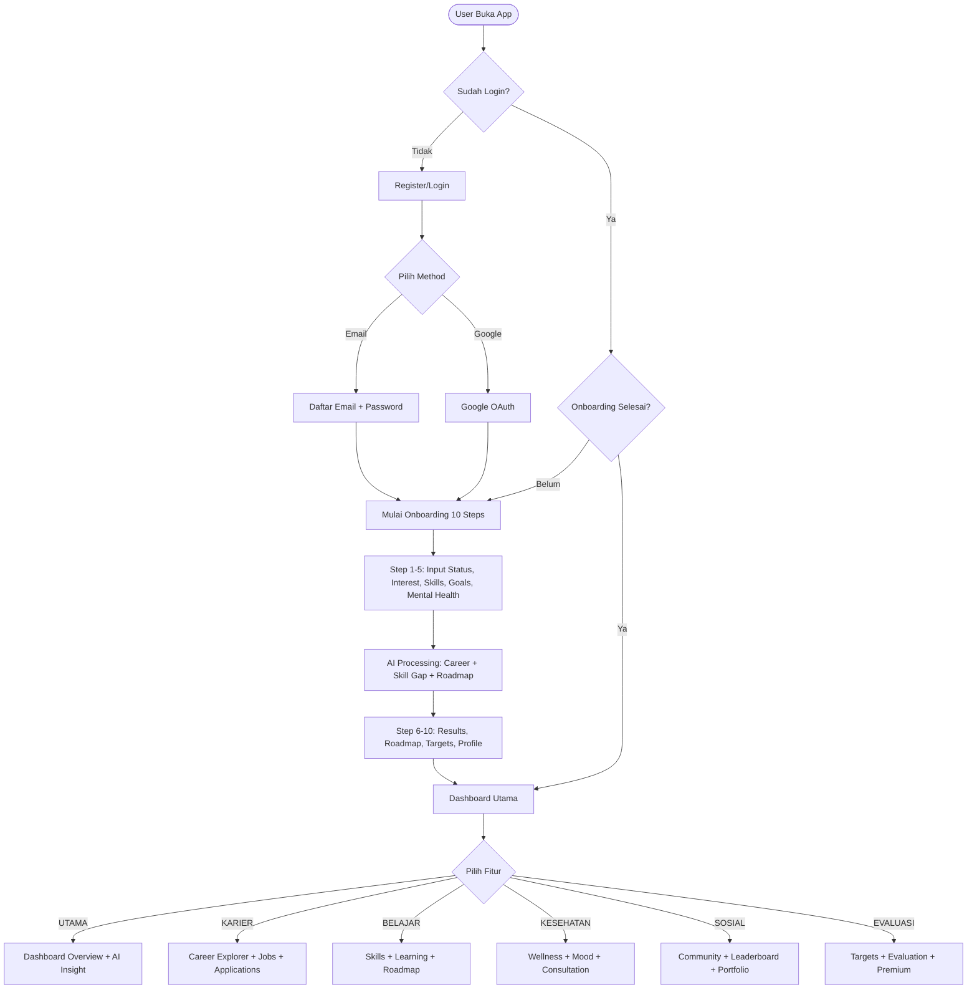
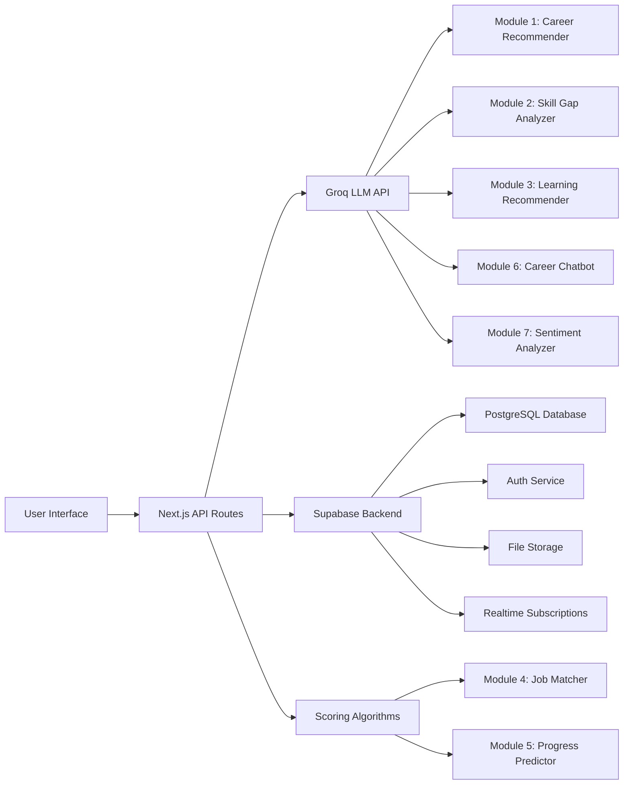
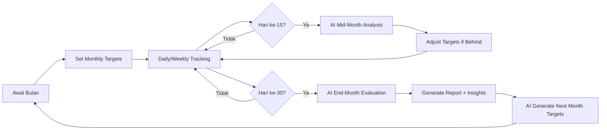

# 🎯 CareerPath.id — MASTER BLUEPRINT
## Consolidated Architecture, AI Modules & Development Guide

> **Status:** Active Directive — Single Source of Truth  
> **Last Updated:** 2026-02-11  
> **Priority:** CRITICAL — Semua pengembangan merujuk pada dokumen ini  
> **Version:** 3.0 (Consolidated dari masterplan + plan + flowplan)

---

## 📑 DAFTAR BLUEPRINT

Dokumen ini adalah **pusat koordinasi** yang terintegrasi dengan blueprint lain:

| Blueprint | Isi | Lokasi |
|-----------|-----|--------|
| **MASTER BLUEPRINT** (ini) | Architecture, AI Modules, Roadmap, Metrics | `blueprints/MASTERPLAN-BLUEPRINT.md` |
| **ADMIN BLUEPRINT** | 18 Admin Modules, Supabase Schema, Roles | `blueprints/ADMIN-BLUEPRINT.md` |
| **UI-UX BLUEPRINT** | Design System, Components, Page Patterns | `blueprints/UI-UX-BLUEPRINT.md` |
| **OPTIMIZATION BLUEPRINT** | Performance, Caching, Bundle, PWA, SEO | `blueprints/OPTIMIZATION-BLUEPRINT.md` |
| **STANDAR FEATURE BLUEPRINT** | Security, CMS, Legal, Gamification, Export | `blueprints/STANDAR-FEATURE-BLUEPRINT.md` |
| **DATABASE BLUEPRINT** | SQL Schema, RLS, Indexes, Seed Data | `blueprints/DATABASE-BLUEPRINT.md` |
| **API BLUEPRINT** | 56 Endpoint Docs, Contracts, Error Standards | `blueprints/API-BLUEPRINT.md` |
| **TESTING BLUEPRINT** | E2E Scenarios, QA Checklist, CI/CD | `blueprints/TESTING-BLUEPRINT.md` |
| **DEPLOYMENT BLUEPRINT** | Env Vars, External Services, Setup Guides | `blueprints/DEPLOYMENT-BLUEPRINT.md` |
| **BUILD FLOW BLUEPRINT** | Alur Pengembangan, Build Order, Roadmap | `blueprints/BUILD-FLOW-BLUEPRINT.md` |
| **PROGRESS LOG** | Changelog per development session | `blueprints/PROGRESS-LOG.md` |

---

## 1. 🎯 CORE VALUE PROPOSITION

### CareerPath.id = Career Operating System untuk Gen Z Indonesia

**End-to-end career guidance** dari goal setting → skill mapping → learning → job readiness → employment.

| Pillar | Deskripsi |
|--------|-----------|
| **Personalized** | Setiap user mendapat roadmap unik berdasarkan profil, skill, dan minat |
| **Predictive** | AI proaktif suggest next steps, bukan hanya reaktif |
| **Actionable** | Complex career planning di-breakdown jadi monthly targets yang jelas |
| **Adaptive** | Learning path adjust based on user progress dan mood |
| **Supportive** | AI + human expertise (konsultasi) untuk holistic support |
| **Scalable** | B2B model untuk impact di level institusi |

### Diferensiasi vs Kompetitor

| Platform | Fokus | CareerPath.id Advantage |
|----------|-------|------------------------|
| JobStreet / KitaLulus | Job portal only | ✅ Full career OS, bukan hanya list jobs |
| Glints | Career content | ✅ AI-powered guidance, bukan hanya konten |
| LinkedIn | Professional networking | ✅ Actionable roadmap, bukan hanya networking |
| Coursera / Udemy | Online courses | ✅ Skill gap → learning → job readiness terintegrasi |
| Calm / Headspace | Mental health | ✅ Career anxiety + mental health dalam satu platform |

**Unique Value:** Satu-satunya platform yang mengintegrasikan **AI career guidance + mental health monitoring + gamification + local job market** khusus untuk Gen Z Indonesia.

---

## 2. 🤖 8 AI MODULES

### Quick Reference

| # | Module | Location | Tech | Phase | Status |
|---|--------|----------|------|-------|--------|
| 1 | Career Path Recommender | Onboarding + Dashboard | Groq LLM | Phase 1 | ✅ Implemented |
| 2 | Skill Gap Analyzer | Skill Mapping | Groq LLM | Phase 1 | ✅ Implemented |
| 3 | Learning Recommender | Learning Dashboard | Groq LLM | Phase 2 | ⚠️ Partial |
| 4 | Job Matcher & Readiness | Job Search | Scoring Algorithm | Phase 2 | ⚠️ Partial |
| 5 | Progress Predictor | Dashboard & Evaluation | Groq LLM | Phase 3 | 🔲 Not Started |
| 6 | Career Chatbot | App-wide (AI FAB) | Groq LLM + RAG | Phase 1 | ✅ Implemented |
| 7 | Sentiment Analyzer | Mood Tracking & Wellness | Groq LLM | Phase 3 | 🔲 Not Started |
| 8 | B2B Analytics Engine | University Dashboard | Groq LLM | Post-PKM | 🔲 Not Started |

---

### Module 1: CAREER PATH RECOMMENDER

**Lokasi:** Onboarding Step 6 + Dashboard Recommendations

**Fungsi:**
- Analisis profil user (pendidikan, minat, skills, goals)
- Rekomendasi 3 career path dengan match percentage & reasoning
- Personalisasi berdasarkan data Makassar (lokal job market)

**Input → Processing → Output:**
```
INPUT:                          PROCESSING:                    OUTPUT:
┌──────────────┐    ┌────────────────────────┐    ┌──────────────────────┐
│ Status       │    │ Groq LLM Analysis      │    │ Top 3 Career Paths   │
│ University   │───▶│ • Profile matching     │───▶│ • Match % + Reasoning│
│ Major        │    │ • Skill-career mapping  │    │ • Salary range       │
│ Interests    │    │ • Local market data     │    │ • Job outlook        │
│ Skills       │    │ • Trend analysis        │    │ • Est. job-ready time│
│ Goals        │    └────────────────────────┘    └──────────────────────┘
└──────────────┘
```

**Contoh Output:**
```
Top 3 Career Paths untuk Kamu:

1. DATA ANALYST (Match: 85%)
   ✅ Alasan: Background Statistika + minat data
   💼 Avg. Salary Makassar: Rp 6-9 juta
   📊 Job Openings: 45 posisi (tinggi)
   📅 Est. Job-Ready: 4 bulan dengan learning plan kami

2. BUSINESS INTELLIGENCE ANALYST (Match: 78%)
   ...

3. MARKET RESEARCH ANALYST (Match: 72%)
   ...
```

---

### Module 2: SKILL GAP ANALYZER

**Lokasi:** Onboarding Step 7 + Skill Dashboard

**Fungsi:**
- Compare current skills vs required skills untuk target karir
- Identifikasi skill gap + prioritas learning
- Visual radar chart (current vs target)
- Color-coded status: ✅ Hijau (punya) / ⚠️ Kuning (perlu upgrade) / ❌ Merah (belum punya)

**Algorithm:**
```
For each required_skill in target_career:
  gap = required_level - current_level
  priority = gap × skill_criticality × market_demand
Sort by priority DESC → generate learning path
```

---

### Module 3: PERSONALIZED LEARNING RECOMMENDER

**Lokasi:** Learning Dashboard

**Fungsi:**
- Rekomendasi course/materi berdasarkan skill gap
- Adaptive learning path yang menyesuaikan progress
- Difficulty matching (beginner → advanced)
- Kurasi konten dari berbagai platform

**Personalization Factors:**
- Current skill level
- Learning pace (dari tracking)
- Time availability (dari target setting)
- Learning style preferences

**Contoh Output:**
```
🔥 Priority (skill gap critical):
- [Course] Advanced SQL Queries (Coursera)
  Match: 95% | Duration: 8 jam | Level: Intermediate

💎 Suggested (nice to have):
- [Course] Data Storytelling (YouTube Playlist)
  Match: 78% | Duration: 5 jam | Level: Beginner

🌟 Trending (mahasiswa lain suka):
- [Workshop] Data Analytics Bootcamp Makassar
  Date: 15 Feb | Location: UH Makassar
```

---

### Module 4: JOB MATCHER & READINESS SCORE

**Lokasi:** Job Search Page

**Fungsi:**
- Smart matching antara user profile dengan job requirements
- Readiness Score (0-100%) untuk setiap job posting
- Breakdown: "Kamu punya 8 dari 10 skills yang dibutuhkan"

**Scoring Algorithm:**
```
Readiness Score =
  (Skills Match × 40%) +
  (Education Match × 25%) +
  (Experience Match × 15%) +
  (Portfolio Strength × 10%) +
  (Location Preference × 10%)
```

**Smart Features:**
- Auto-filter jobs dengan match >70%
- Suggest "quick wins" (jobs yang hanya kurang 1-2 skills)
- Predict application success rate
- AI-generated cover letter template per job

---

### Module 5: PROGRESS PREDICTOR

**Lokasi:** Dashboard Overview + Monthly Evaluation

**Fungsi:**
- Tracking skill improvement dari waktu ke waktu
- Prediksi kapan user akan "job-ready"
- Early warning jika progress melambat
- Motivational insights & benchmarking

**Output Contoh:**
```
"Dengan pace ini, kamu akan siap melamar dalam 2 bulan"
"Skill SQL meningkat 30% bulan ini - pertahankan!"
"Users dengan profil serupa biasanya apply 8 jobs/bulan, kamu baru 3"
```

---

### Module 6: AI CAREER CHATBOT

**Lokasi:** Floating Action Button (FAB) — seluruh aplikasi

**Fungsi:**
- 24/7 career Q&A
- Guide user dalam setting goals & targets
- Pre-screening sebelum konsultasi profesional
- Context-aware: tahu profil, skill, dan progress user

**Tech Stack:**
- Groq LLM (llama/mixtral models)
- RAG dengan career knowledge base
- Conversation history per user
- Supabase untuk context storage

**Use Cases:**
```
"Apa karir yang cocok untuk jurusan Teknik Informatika?"
"Skill apa yang harus saya pelajari untuk jadi Data Analyst?"
"Saya merasa overwhelmed, apa yang harus dilakukan?"
"Bagaimana cara menulis CV untuk entry-level position?"
```

---

### Module 7: SENTIMENT ANALYZER

**Lokasi:** Mood Tracking + Journal Entries

**Fungsi:**
- Analisis mood & sentiment dari journal entries
- Deteksi early warning signs of anxiety/depression
- Trigger rekomendasi konsultasi psikolog

**Privacy-First Approach:**
- Data encrypted
- No external sharing
- User control: bisa turn off fitur ini
- Alert thresholds configurable

---

### Module 8: B2B ANALYTICS ENGINE

**Lokasi:** University Dashboard (B2B)

**Fungsi:**
- Aggregate analytics mahasiswa per kampus
- Identify skill trends & gaps di level institusi
- Rekomendasi program pelatihan
- Employment readiness reports

**Deliverables untuk Kampus:**
```
Report: Teknik Informatika Batch 2022

Employability Readiness: 68%

Top Skill Gaps:
1. Cloud Computing (75% mahasiswa belum punya)
2. DevOps Tools (62% mahasiswa)
3. Presentation Skills (58% mahasiswa)

Recommendations:
- Add elective: Introduction to AWS
- Workshop: DevOps Fundamentals
- Bootcamp: Public Speaking

Predicted Employment Rate (6 months): 72%
(vs national avg: 65%)
```

---

## 3. 🗺️ SYSTEM FLOW DIAGRAMS

### 3.1 Main Application Flow



### 3.2 AI Integration Points



### 3.3 Monthly Evaluation Cycle



---

## 4. 🛠️ TECH STACK (ACTUAL)

### Frontend

| Component | Technology | Version |
|-----------|------------|---------|
| Framework | Next.js (App Router) | 16.1.6 |
| Language | TypeScript | 5.x |
| Styling | Tailwind CSS | 4.x |
| Animations | Framer Motion | 12.x |
| Charts | Recharts | 3.x |
| Icons | Lucide React | 0.563.x |
| Class Utilities | clsx + tailwind-merge | Latest |
| Confetti | canvas-confetti | 1.x |

### Backend

| Component | Technology | Notes |
|-----------|------------|-------|
| Database | Supabase (PostgreSQL) | Single source of truth |
| Auth | Supabase Auth | Email + session management |
| Storage | Supabase Storage | File & image upload |
| Realtime | Supabase Realtime | Planned for notifications |
| API | Next.js API Routes | `/api/*` endpoints |
| AI/LLM | Groq API | llama/mixtral models |
| Payments | Midtrans Snap | Premium subscription |

### DevOps

| Component | Technology |
|-----------|------------|
| Hosting | Vercel |
| CI/CD | Vercel auto-deploy (GitHub) |
| Version Control | GitHub |
| E2E Testing | Playwright |
| Monitoring | Planned: Sentry + Vercel Analytics |

---

## 5. 📊 DATABASE SCHEMA

### Core Domain Tables

```
┌─────────────────────────────────────────────────────────────┐
│                        USERS DOMAIN                          │
├─────────────────────────────────────────────────────────────┤
│ users (Supabase Auth)      │ profiles                        │
│ - id (uuid)                │ - id (uuid)                     │
│ - email                    │ - user_id (fk → users)          │
│ - created_at               │ - full_name                     │
│                            │ - status (mahasiswa/fresh/etc)  │
│                            │ - university, major             │
│                            │ - career_target                 │
│                            │ - onboarding_completed          │
│                            │ - total_xp, level               │
│                            │ - avatar_url                    │
│                            │ - role (user/admin)             │
└─────────────────────────────────────────────────────────────┘

┌─────────────────────────────────────────────────────────────┐
│                      SKILLS DOMAIN                           │
├─────────────────────────────────────────────────────────────┤
│ skills                     │ user_skills                     │
│ - id, name                 │ - user_id (fk)                  │
│ - category                 │ - skill_id (fk)                 │
│ - type (hard/soft)         │ - proficiency (1-5)             │
│ - description              │ - target_level                  │
│                            │ - updated_at                    │
└─────────────────────────────────────────────────────────────┘

┌─────────────────────────────────────────────────────────────┐
│                     CAREERS & JOBS DOMAIN                     │
├─────────────────────────────────────────────────────────────┤
│ careers                    │ jobs                            │
│ - id, title                │ - id, title, company            │
│ - description              │ - location, type, salary_range  │
│ - salary_range             │ - requirements, status          │
│ - required_skills          │ - career_id (fk)                │
│ - job_outlook              │ - created_at, expires_at        │
│                            │                                 │
│ job_applications           │ saved_jobs                      │
│ - user_id, job_id          │ - user_id, job_id               │
│ - status, applied_at       │ - saved_at                      │
│ - notes                    │                                 │
└─────────────────────────────────────────────────────────────┘

┌─────────────────────────────────────────────────────────────┐
│                     LEARNING DOMAIN                          │
├─────────────────────────────────────────────────────────────┤
│ courses                    │ user_courses                    │
│ - id, title, provider      │ - user_id (fk)                  │
│ - duration_hours           │ - course_id (fk)                │
│ - skill_id (fk)            │ - progress (%)                  │
│ - difficulty, category     │ - completed_at                  │
│ - is_published             │ - xp_earned                     │
│                            │                                 │
│ quizzes                    │ quiz_attempts                   │
│ - id, title, course_id     │ - user_id, quiz_id              │
│ - questions (jsonb)        │ - score, completed_at           │
└─────────────────────────────────────────────────────────────┘

┌─────────────────────────────────────────────────────────────┐
│                    WELLNESS DOMAIN                            │
├─────────────────────────────────────────────────────────────┤
│ wellness_logs              │ mood_entries                    │
│ - user_id, responses       │ - user_id, mood (1-5)           │
│ - score, risk_level        │ - journal_text, tags            │
│ - ai_recommendation        │ - created_at                    │
│ - created_at               │                                 │
│                            │                                 │
│ consultations              │ professionals                   │
│ - user_id, professional_id │ - id, name, specialty           │
│ - date, time, status       │ - rating, availability          │
│ - type (career/psikolog)   │ - price_per_session             │
└─────────────────────────────────────────────────────────────┘

┌─────────────────────────────────────────────────────────────┐
│                    COMMUNITY & GAMIFICATION                   │
├─────────────────────────────────────────────────────────────┤
│ community_posts            │ post_comments                   │
│ - id, user_id, content     │ - post_id, user_id              │
│ - category, likes_count    │ - content, created_at           │
│ - is_pinned, created_at    │                                 │
│                            │                                 │
│ badges                     │ user_badges                     │
│ - id, name, description    │ - user_id, badge_id             │
│ - icon, rarity, condition  │ - earned_at                     │
│                            │                                 │
│ monthly_targets            │ target_progress                 │
│ - user_id, month, year     │ - target_id, progress           │
│ - learning_target          │ - updated_at                    │
│ - application_target       │                                 │
│ - portfolio_target         │                                 │
└─────────────────────────────────────────────────────────────┘

┌─────────────────────────────────────────────────────────────┐
│                       ADMIN DOMAIN                           │
├─────────────────────────────────────────────────────────────┤
│ admin_audit_logs           │ site_settings                   │
│ - admin_id, action         │ - key, value                    │
│ - target_type, target_id   │ - updated_at, updated_by        │
│ - details, created_at      │                                 │
│                            │                                 │
│ contact_messages           │ page_content                    │
│ - name, email, subject     │ - page_name (about/features/..) │
│ - message, status          │ - content (jsonb)               │
│ - created_at               │ - updated_at                    │
│                            │                                 │
│ payments                   │ subscriptions                   │
│ - user_id, amount          │ - user_id, plan_type            │
│ - payment_method           │ - start_date, end_date          │
│ - status, midtrans_id      │ - status, auto_renew            │
└─────────────────────────────────────────────────────────────┘
```

> 🔗 Untuk schema SQL lengkap dan tabel tambahan, lihat **ADMIN-BLUEPRINT.md** Section 4.

---

## 6. 📁 PROJECT STRUCTURE (ACTUAL)

```
careerpath-id/
├── blueprints/                    # Semua blueprint dokumen
│   ├── MASTERPLAN-BLUEPRINT.md    # ← Dokumen ini
│   ├── ADMIN-BLUEPRINT.md
│   ├── UI-UX-BLUEPRINT.md
│   ├── OPTIMIZATION-BLUEPRINT.md
│   ├── STANDAR-FEATURE-BLUEPRINT.md
│   └── progres log.md
│
├── src/
│   ├── app/
│   │   ├── page.tsx               # Landing page
│   │   ├── login/                 # Auth pages
│   │   ├── register/
│   │   ├── onboarding/            # 10-step onboarding wizard
│   │   │
│   │   ├── dashboard/             # Main app (17 pages)
│   │   │   ├── page.tsx           # Dashboard overview
│   │   │   ├── careers/           # Career explorer
│   │   │   ├── jobs/              # Job search
│   │   │   ├── applications/      # Application tracker
│   │   │   ├── skills/            # Skill tracking + radar chart
│   │   │   ├── learning/          # Courses + quiz
│   │   │   ├── roadmap/           # AI learning roadmap
│   │   │   ├── portfolio/         # Portfolio + certificates
│   │   │   ├── wellness/          # GAD-7 wellness check
│   │   │   ├── mood/              # Mood tracking + journal
│   │   │   ├── consultation/      # Booking + video call
│   │   │   ├── community/         # Forum & discussions
│   │   │   ├── leaderboard/       # XP ranking
│   │   │   ├── evaluation/        # Monthly evaluation
│   │   │   ├── premium/           # Subscription plans
│   │   │   ├── targets/           # Monthly targets
│   │   │   ├── guide/             # User guide
│   │   │   ├── settings/          # User settings
│   │   │   └── profile/           # Profile management
│   │   │
│   │   ├── admin/                 # Admin panel (9 existing modules)
│   │   │   ├── page.tsx           # Admin dashboard
│   │   │   ├── users/
│   │   │   ├── jobs/
│   │   │   ├── careers/
│   │   │   ├── skills/
│   │   │   ├── content/
│   │   │   ├── messages/
│   │   │   ├── analytics/
│   │   │   ├── logs/
│   │   │   └── settings/
│   │   │
│   │   ├── b2b/dashboard/         # B2B university dashboard
│   │   ├── portfolio/[username]/  # Public portfolio
│   │   │
│   │   ├── api/                   # API routes
│   │   │   ├── ai/                # AI endpoints (career, chat, etc)
│   │   │   ├── admin/             # Admin CRUD APIs
│   │   │   └── ...
│   │   │
│   │   └── (public pages)         # About, Features, FAQ, Blog, Contact,
│   │                              # Privacy, Terms, Not-found, Error
│   │
│   ├── components/                # Shared components
│   │   ├── FloatingWhatsApp.tsx
│   │   ├── AIChatFAB.tsx
│   │   └── ...
│   │
│   └── lib/                       # Utilities
│       ├── supabase/              # Supabase client (browser + server)
│       └── utils.ts
│
├── public/                        # Static assets
├── tests/                         # Playwright E2E tests
├── .agent/workflows/              # AI agent workflows
└── next.config.ts                 # Next.js configuration
```

---

## 7. 🚀 IMPLEMENTATION PHASES

### Phase 1: Foundation ✅ COMPLETED (Month 1-2)

**Features Built:**
- [x] Email/password authentication (Supabase Auth)
- [x] 10-step onboarding wizard
- [x] Dashboard with overview, AI insights, quick actions
- [x] User profile & settings
- [x] Landing page with hero, features, testimonials, CTA
- [x] Public pages (About, Features, FAQ, Privacy, Terms, Contact, Blog)
- [x] Admin panel with 9 modules (Users, Jobs, Careers, Skills, Content, Messages, Analytics, Logs, Settings)
- [x] Security headers (CSP, HSTS, XSS protection)
- [x] Session timeout component

**AI Module 1 (Career Recommender):** ✅ Groq LLM integration  
**AI Module 6 (Career Chatbot):** ✅ Groq LLM + floating FAB

---

### Phase 2: Core Features ✅ MOSTLY COMPLETED (Month 3-4)

**Features Built:**
- [x] Skill tracking with radar chart + proficiency levels
- [x] Learning module with course discovery + quiz system
- [x] Job search listing
- [x] Portfolio builder + certificate management
- [x] Community forum
- [x] XP & leaderboard system
- [x] Career explorer page

**Still In Progress:**
- [ ] Job matching with readiness score (mock data)
- [ ] Application tracking (mock data, needs backend)
- [ ] Course progress auto-updates
- [ ] Portfolio AI optimizer

**AI Module 2 (Skill Gap):** ✅ Groq LLM in onboarding  
**AI Module 3 (Learning):** ⚠️ Partial — curated content, limited AI personalization  
**AI Module 4 (Job Matcher):** ⚠️ Basic — needs scoring algorithm implementation

---

### Phase 3: AI Enhancement + Premium (Month 5-6) — CURRENT

**Features Built:**
- [x] Monthly target setting structure
- [x] Wellness check (GAD-7 questionnaire)
- [x] Mood tracking + journaling
- [x] Consultation booking (mock professionals)
- [x] Video consultation page
- [x] Premium subscription page (Midtrans Snap)
- [x] Monthly evaluation overview
- [x] AI roadmap generation

**Still Needed:**
- [ ] Monthly evaluation AI insights
- [ ] Mid-month check-in automation
- [ ] Real professional database for consultations
- [ ] Payment processing flow completion
- [ ] Real-time notifications (Supabase Realtime)

**AI Module 5 (Progress Predictor):** 🔲 Not started  
**AI Module 7 (Sentiment Analyzer):** 🔲 Not started

---

### Phase 4: Post-PKM Scale (Month 7-12)

**Planned:**
- [ ] B2B University Dashboard (full)
- [ ] AI Module 8 (B2B Analytics)
- [ ] Social Login (Google OAuth)
- [ ] Dark Mode
- [ ] PWA + Service Worker
- [ ] Advanced gamification (badges, streaks, challenges)
- [ ] Email notification system
- [ ] Data export + account deletion
- [ ] Internationalization (English support)
- [ ] Mobile app optimization

---

## 8. 📱 USER JOURNEY

### 8.1 New User → Active User

```
Register → Onboarding (15 min) → Dashboard → Set Targets → Daily Usage
   │              │                    │              │           │
   │         AI analyzes         AI insights      Monthly    Skill tracking
   │         profile &           & recommendations  goals    + Learning
   │         generates                                       + Job search
   │         roadmap
   ▼
   Landing Page → Features → Register → Verify Email → Onboarding
```

### 8.2 Daily Usage Loop

```
Login → Dashboard Overview
         │
         ├── 📊 Check progress (XP, streak, targets)
         ├── 📚 Continue course / take quiz (+XP)
         ├── 💼 Browse jobs / track applications
         ├── 📝 Mood check-in / journal entry
         ├── 💬 Community discussion
         ├── 🤖 Chat with AI Career Assistant
         └── 🎯 Update skill proficiency
```

### 8.3 Monthly Cycle

```
Week 1: Set targets + plan learning
Week 2: Mid-month check-in + AI adjustment
Week 3: Intensive learning / applying
Week 4: Evaluation + celebration + next month planning
```

---

## 9. 🎮 GAMIFICATION SYSTEM

### XP Earning Table

| Action | XP | Frequency |
|--------|-----|-----------|
| Complete onboarding | +100 | One-time |
| Complete a course | +50 | Per course |
| Pass a quiz (80%+) | +25 | Per quiz |
| Update skill proficiency | +10 | Per skill |
| Apply for a job | +15 | Per application |
| Write journal entry | +5 | Per entry |
| Complete wellness check | +10 | Per check |
| Post in community | +5 | Per post |
| Daily login | +5 | Per day |
| Achieve monthly target | +100 | Per month |

### Level Tiers

| Level | XP Required | Title |
|-------|-------------|-------|
| 1 | 0-99 | Newbie |
| 2 | 100-299 | Explorer |
| 3 | 300-599 | Learner |
| 4 | 600-999 | Achiever |
| 5 | 1000-1499 | Pro |
| 6 | 1500-2499 | Expert |
| 7 | 2500-3999 | Master |
| 8 | 4000-5999 | Legend |
| 9 | 6000-9999 | Champion |
| 10 | 10000+ | Career Hero |

### Planned Badges
- 🎓 First Course Complete — selesaikan course pertama
- 🔥 7-Day Streak — login 7 hari berturut-turut
- 📊 Skill Master — skill level 5 di salah satu skill
- 💼 Job Hunter — apply 10 jobs
- 🧠 Mind Care — 30 mood check-ins
- 🏆 Top 10 — masuk leaderboard top 10
- ⭐ Target Crusher — achieve semua monthly targets

---

## 10. 💰 MONETIZATION / BUSINESS MODEL

### Revenue Streams

| Stream | Price | Target |
|--------|-------|--------|
| **Premium Subscription** | Rp 49.000-149.000/bulan | 10% of active users |
| **Consultation Fee** | Rp 99.000/sesi (platform fee ~30%) | Average 50 sesi/bulan |
| **B2B University** | Rp 5.000.000/project (per semester) | 2 universities Year 1 |

### Premium vs Free

| Feature | Free | Premium |
|---------|------|---------|
| AI Career Recommendation | ✅ 1x (onboarding) | ✅ Unlimited |
| AI Chatbot | ✅ 3 chat/hari | ✅ Unlimited |
| Skill Tracking | ✅ Full | ✅ Full |
| Learning Module | ✅ Basic courses | ✅ Advanced + AI path |
| Job Search | ✅ List only | ✅ Match % + Readiness |
| Mood Tracking | ✅ Full | ✅ Full + AI analysis |
| Portfolio | ✅ Basic | ✅ AI optimizer + PDF export |
| Consultation | ❌ | ✅ Booking access |
| Priority Support | ❌ | ✅ WhatsApp + email |

---

## 11. 🤝 AI ETHICS & PRIVACY

### Transparency
- Explain AI recommendations (explainable AI)
- User can see why AI recommend X
- No "black box" decisions
- AI confidence score displayed

### User Control
- Opt-out dari AI features tertentu
- Delete AI-generated data
- Export semua data pribadi
- Turn off mood/sentiment analysis

### Privacy-First
- Data tidak dijual ke third party
- Consultation records fully encrypted
- Aggregate data untuk B2B (anonymized)
- Comply with UU PDP (Perlindungan Data Pribadi Indonesia)

### Bias Mitigation
- Regular audit untuk gender/education bias
- Diverse career path data
- Feedback loop untuk improve fairness
- Local market data focus (Makassar → Indonesia)

---

## 12. 📈 SUCCESS METRICS

### User Metrics

| Metric | 6 Months | 12 Months |
|--------|----------|-----------|
| Total Users | 1,500 | 3,000 |
| Active Users (MAU) | 750 (50%) | 1,500 (50%) |
| Onboarding Completion | 80% | 85% |
| Premium Conversion | 10% | 15% |
| Month-over-Month Retention | 70% | 75% |

### AI Performance

| Metric | Target |
|--------|--------|
| Career Recommendation Satisfaction | 70%+ |
| Job Match Accuracy | 80%+ users agree |
| Learning Recommendation CTR | 60%+ |
| Chatbot Resolution Rate | 65%+ tanpa human |
| Prediction Accuracy | Job-ready within ±2 weeks |

### Impact

| Metric | Target |
|--------|--------|
| Users Getting Jobs (6 months) | 50%+ |
| Skill Level Improvement (3 months) | +40% average |
| Anxiety Reduction | 60% report less anxiety |
| B2B Impact | Partner universities +15% employability |

---

## 13. 🔮 FUTURE VISION

### Year 1: Establish
- Solid product-market fit di Makassar
- 2 university partnerships
- 3,000+ registered users
- Sustainable premium revenue

### Year 2: Expand
- Expand ke 5+ kota di Indonesia
- 10+ university partnerships
- Mobile app (React Native)
- Advanced AI models (fine-tuned)
- 10,000+ users

### Year 3: Scale
- National coverage Indonesia
- Corporate B2B (perusahaan hiring)
- International expansion (Southeast Asia)
- AI talent marketplace
- 50,000+ users

---

> **📖 REFERENCE:**  
> - Detail admin modules → `ADMIN-BLUEPRINT.md`  
> - UI/UX design system → `UI-UX-BLUEPRINT.md`  
> - Performance optimization → `OPTIMIZATION-BLUEPRINT.md`  
> - Standard features checklist → `STANDAR-FEATURE-BLUEPRINT.md`  
> - Database schema & RLS → `DATABASE-BLUEPRINT.md`  
> - API endpoint docs → `API-BLUEPRINT.md`  
> - Testing strategy → `TESTING-BLUEPRINT.md`  
> - Deployment & env vars → `DEPLOYMENT-BLUEPRINT.md`  
> - Development changelog → `PROGRESS-LOG.md`
>
> **💡 Dokumen ini harus di-update setiap sprint untuk reflect actual progress.**
